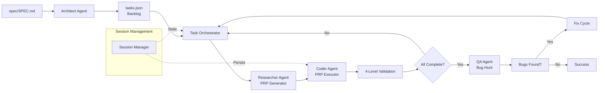

# PRP Pipeline

<p align="center">
  <a href="https://github.com/dabstractor/hacky-hack/actions/workflows/ci.yml">
    
  </a>
  <a href="https://codecov.io/gh/YOUR_USERNAME/hacky-hack">
    
  </a>
  <a href="https://badge.fury.io/js/hacky-hack">
    
  </a>
  <a href="https://github.com/dabstractor/hacky-hack/blob/main/LICENSE">
    
  </a>
  <br/>
  <a href="https://github.com/dabstractor/hacky-hack">
    
  </a>
  <a href="https://github.com/dabstractor/hacky-hack">
    
  </a>
</p>

Autonomous AI-powered development pipeline that transforms Product Requirement
Documents (PRDs) into implemented code through multi-agent orchestration.

## What is PRP Pipeline?

PRP Pipeline is an autonomous software development system that transforms
Product Requirement Documents (PRDs) into working code through AI agent
orchestration.

At its core is the **Product Requirement Prompt (PRP)** - a structured prompt
that provides AI agents with complete context, clear objectives, and
validation criteria for implementing work units correctly in a single pass.

**Why PRP Pipeline?**

- **Autonomous Development**: Transform requirements into working code automatically
- **Context-Dense Prompts**: Every PRP contains everything needed for one-pass implementation
- **Progressive Validation**: 4-level quality gates catch defects early
- **Resumable Sessions**: Pause and resume with state persistence
- **Delta Sessions**: Re-execute changed tasks AND decompose newly-added requirements into new tasks when PRDs are updated



See [PROMPTS.md](PROMPTS.md) for the complete PRP concept definition.

## Quick Start

Get running in under 2 minutes:

### Prerequisites

- Node.js >= 20.0.0
- npm >= 10.0.0
- Git
- A z.ai credential — run `pi /login` (writes `~/.pi/agent/auth.json`) **or** `export ZAI_API_KEY=…`. (Anthropic credentials are optional; see [Configuration](#configuration).)

### Installation

```bash
# Clone the repository
git clone https://github.com/dabstractor/hacky-hack.git
cd hacky-hack

# Install dependencies
npm install
```

### Run Your First Pipeline

```bash
# Run with the example PRD
npm run dev -- --prd spec/SPEC.md

# See what would happen without executing
npm run dev -- --prd spec/SPEC.md --dry-run
```

That's it! The pipeline will analyze your PRD, generate tasks, and implement them through AI agents.

**Next Steps**: Check out [Usage Examples](#usage-examples) or [Configuration](#configuration).

## Running from Anywhere

You don't have to `cd` to the repository root. At startup `hack` walks upward from your
current directory to the nearest `.git` entry (a directory for a normal clone, or a file for
a worktree/submodule) and `chdir`s to that repository root before doing anything else
(PRD §9.8). The session directory, `spec/SPEC.md`, `.hack`, `.env`, and `plan/` are all resolved
relative to that root, so the same invocation works from anywhere inside the repo. This applies
to **every** subcommand — `task`, `status`, `update`, `cache`, `inspect`, `artifacts`,
`validate-state`, and `config` — not just the default pipeline run, because `hack` resolves and `chdir`s to the
root before each subcommand's action handler runs.

```bash
# Invoked from a deep subdirectory — resolves to the repo root automatically
cd src/core/deep/nested && hack status
```

> If you are not inside a git repository, `hack` exits non-zero with a `NotARepositoryError`
> naming the directory it searched from (PRD §9.8.5). Pass `--repo-root <path>` (PRD §9.8.6)
> to pin an explicit root and skip the upward `.git` search. See
> [CLI Reference](docs/CLI_REFERENCE.md) for the full flag list.

## Distributed (Multi-File) PRDs

A PRD can be authored across multiple files and assembled into one canonical document at load
time (PRD §2.3). An `@path/to/file.md` token is an _include directive_ — replaced inline by the
referenced file's contents (resolved project-root-relative to the entry PRD's directory,
recursively with cycle detection up to `PRD_INCLUDE_MAX_DEPTH`, default `10`). Set
`PRD_INCLUDE_MARKERS` to emit `<!-- @include: path -->` markers; a stale include warns on
stderr. Hashing, `prd_snapshot.md`, delta detection, and `prd_selectors`/mdsel all operate over
the **fully-resolved** document, so a split PRD behaves identically to a monolithic one.
`prd_selectors` additionally scope each researcher to only the relevant PRD sections. See
[Configuration](docs/CONFIGURATION.md#distributed-prds) for the env knobs.

## Features

- **4 AI Engines**: Specialized agents for Architecture, Research, Implementation, and QA
- **Hierarchical Task Decomposition**: Organize work into Phases → Milestones → Tasks → Subtasks
- **Distributed (Multi-File) PRDs**: `@include` directives assemble a canonical resolved
  document; `prd_selectors` scope each researcher to relevant PRD sections.
- **Delta Sessions**: Automatically detect PRD changes — re-execute affected tasks and decompose newly-added requirements into new tasks
- **QA Bug Hunt**: 3-phase testing (syntax, unit, integration, creative)
- **Scoped Execution**: Run specific phases, milestones, or tasks
- **Resumable Sessions**: Pause and resume with Ctrl+C graceful shutdown
- **4-Level Validation**: Syntax, unit tests, integration tests, and manual validation gates — gates are monotonic terminal-state assertions (PRD §9.9): the executor re-runs every gate as a batch on the final tree and neutralizes non-monotonic negative-existence gates.
- **Smart Git Integration**: Automatic commits with generated messages
- **Performance Optimizations**: PRP caching, I/O batching, and parallel research
- **Depth-Chained Parallel Research**: prefetch up to N items ahead with synchronous fallback
  (see [Self-Healing & Resilience](#self-healing--resilience)).
- **Two-Phase Commits**: a survival commit before cleanup + a doc-reorg commit after, so
  interrupted runs never orphan `plan/` directories.
- **State Integrity Protection**: flock-guarded `tasks.json`, critical-file restore, terminal
  watchdog kills, and a `NO_ISSUES_FOUND.md` hunt marker.
- **Self-Healing & Resilience**: Research deadlines with fallback, issue-driven re-planning,
  and automatic `tasks.json` recovery (see [Self-Healing & Resilience](#self-healing--resilience))

## Self-Healing & Resilience

The pipeline recovers from common agent failures without human intervention. Six mechanisms
keep a session running:

- **Depth-chained parallel research** — background research prefetches a **chain** of up to
  `RESEARCH_DEPTH` (default `2`) items ahead (PRD §4.2). On `RESEARCH_TIMEOUT` (default `1800`s)
  the in-flight research is abandoned and the item is re-researched synchronously inline, so a
  single hung agent cannot stall the pipeline. Research settings forward to bugfix children.
- **Two-phase commits** — each item commits **twice** via the Smart Commit tool (`stagecoach`):
  a pre-cleanup _survival commit_ (source + `plan/` + `Complete` status) and a post-cleanup
  _doc-reorg commit_. A force-interrupt can therefore never orphan a "Complete on disk but
  uncommitted" `plan/` directory (PRD §4.2 step 4 / §5.1).
- **State integrity protection** — guards around `tasks.json` and the working tree (PRD §5.1):
  a `flock`-based process-level mutex serializes `tasks.json` read-modify-write;
  `restore_critical_files` in `smartCommit` blocks deletion of forbidden critical files; a
  status-delta re-apply + git-history restore runs after each agent run (discarding unauthorized
  mutations); watchdog kills (`exit 124`) are **terminal** and never retried; a
  `NO_ISSUES_FOUND.md` marker distinguishes "already hunted" from "never hunted" (PRD §4.4).
- **Issue-driven re-planning** — when a coder reports an `issue` (a recoverable planning gap),
  the stale PRP is deleted, the item is reset, and research re-runs with the captured feedback.
  Re-plans are bounded by `ISSUE_RETRY_MAX` (default `3`; PRD §4.5) before the item hard-fails.
  Change classification (COSMETIC/SUBSTANTIVE; PRD §4.3) retries transient API failures before
  falling back to a protective default.
- **`tasks.json` corruption recovery** — after every agent run the orchestrator re-applies only
  the legitimate status delta (discarding unauthorized mutations) and restores a corrupted
  `tasks.json` from git history. This is automatic and non-fatal (PRD §5.1).

For details, see [Resilience Tuning](docs/CONFIGURATION.md#resilience-tuning) (env-var knobs),
[Issue-Driven Re-planning](docs/WORKFLOWS.md#issue-driven-re-planning) (re-planning flow), and
[tasks.json Protection & Smart Recovery](docs/ARCHITECTURE.md#tasksjson-protection--smart-recovery)
(recovery internals).

## Usage Examples

### Basic Pipeline Execution

```bash
# Run full pipeline with your PRD
npm run dev -- --prd spec/SPEC.md

# Run with verbose output
npm run dev -- --prd spec/SPEC.md --verbose
```

### Scoped Execution

Execute specific portions of your project:

```bash
# Run specific phase
npm run dev -- --prd spec/SPEC.md --scope P3

# Run specific milestone
npm run dev -- --prd spec/SPEC.md --scope P3.M4

# Run specific task
npm run dev -- --prd spec/SPEC.md --scope P3.M4.T2

# Run single subtask
npm run dev -- --prd spec/SPEC.md --scope P3.M4.T2.S1
```

### Delta Session (PRD Changes)

When you modify your PRD, run in delta mode to re-execute changed tasks:

```bash
# Run in delta mode (re-execute changed tasks; decompose added requirements)
npm run dev -- --prd spec/SPEC.md --mode delta
```

The delta breakdown runs over `delta_prd.md` (the structured diff slice), so **added**
requirements are decomposed into new `Phase → Milestone → Task → Subtask` items
(via `decomposePRD()`); **modified** requirements are reset to `Planned` and
**removed** ones to `Obsolete`. (PRD §4.3.) A **COSMETIC-only** PRD edit
(whitespace/formatting) is detected by the change classifier and absorbed as the
new baseline **without** spawning a delta session — only **SUBSTANTIVE** changes
enter delta mode. Added requirements also **survive ID collisions**: when the
architect's freshly-numbered IDs collide with the patched ID space, the colliding
items are renumbered-and-appended rather than dropped (see
[Architecture](docs/ARCHITECTURE.md#delta-sessions)).

### Bug Hunt Mode

Run QA bug hunt even with incomplete tasks:

```bash
# Run QA bug hunt mode
npm run dev -- --prd spec/SPEC.md --mode bug-hunt
```

Each bug-hunt iteration that finds bugs creates a new **numbered** bugfix session
under `bugfix/` — `bugfix/001_<hash>/`, `bugfix/002_<hash>/`, … — via
`nextBugfixDir()`. Prior iterations are **archived, not overwritten**, preserving
the audit trail; the full session-path shape is `plan/NNN_<hash>/bugfix/NNN_<hash>/`
(PRD §4.4 / §5.1).

### Adopt an Existing Codebase (--adopt-prd)

Declare an _already-shipped_ codebase as the implementation of the PRD (PRD §4.6). On a
**fresh project** (no `plan/` sessions) this seeds a completed baseline session so future PRD
edits produce deltas against the real code; validation + bug-hunt still run. Guard rails: no-op
(warn + proceed) if sessions already exist; rejects an empty session dir.

```bash
# Seed a baseline session for an existing implementation
npm run dev -- --prd spec/SPEC.md --adopt-prd
```

### Accept PRD Edits as Baseline (--accept-prd-changes)

For doc-only edits or changes that merely describe already-finished work, accept the PRD edits
as the new baseline **without** spawning a delta session (PRD §4.3). It cancels the queued
`.pending_delta_hash`, refreshes `prd_snapshot.md` to the current PRD, and resumes idempotently.

```bash
# Accept PRD edits without a delta session
npm run dev -- --prd spec/SPEC.md --continue --accept-prd-changes
```

### Task Status (hack status / hack task)

`hack status` is an alias of `hack task` (git muscle memory; PRD §5.3) for inspecting the current
session's backlog. Bugfix tasks discovered before main-session tasks are surfaced first.

```bash
# List all tasks in the current session
hack status
# Same thing, git-style alias
hack task

# Show the next executable (Planned) subtask
hack task next

# Status-counts summary (grouped by status)
hack task status
```

> **Breakdown-in-progress (PRD §5.3):** if `hack status` / `hack task` / `hack task next`
> resolves a session whose directory exists but whose `tasks.json` has not been written yet
> (the window between session creation and the Architect Agent finishing decomposition), the
> command prints a single calm stderr notice and exits `0` — this is an observation of a valid
> transient state, not a failure. With `--output json` it emits
> `{ "status": "awaiting_breakdown", "session": "NNN_hash" }` instead. An explicit
> `--file <path>` pointing at a missing file, and the no-sessions-at-all state, remain **hard
> errors** (exit non-zero) — only the auto-resolved (discovered) tasks file gets the graceful
> path. See [CLI Reference](docs/CLI_REFERENCE.md).

### Manual Status Update (`hack update`)

`hack update <task-id> <status>` (PRD §5.4) manually rewrites a task item's status from the
command line, with **both** the task ID and the target status **fuzzy-matched**: canonical
(`P1.M1.T1.S1`), concatenated (`p1m1t1s1`), and numeric (`1.1.1.1`, `1.2`) IDs all resolve
(trailing segments optional → Phase/Milestone/Task/Subtask), and statuses accept synonyms
(`done`, `re`, `comp`), canonical words, prefixes, and substrings (`r` is ambiguous →
Ready/Researching). Setting a parent `Complete` **cascades `Complete` down** to every
descendant; after any change every ancestor **recomputes bottom-up** to the least-progressed
child, so marking the last subtask `Complete` promotes its Task/Milestone/Phase and resetting a
subtask back to `Planned` drops its ancestors accordingly. It is the write-side counterpart to
the read-only `hack status` / `hack task` above.

```bash
hack update P1.M1.T1.S1 ready        # full canonical form
hack update p1m1t1s1 ready           # concatenated, case-insensitive
hack update 1.1.1.1 re               # numeric form + synonym status
hack update 1.2 done                 # milestone + synonym status
hack update 2 comp                   # phase + prefix status
```

> The command is a serialized, lock-guarded, atomic read-modify-write under the same
> `tasks.json.lock` as the orchestrator (PRD §5.1, §5.4) — it can neither corrupt `tasks.json`
> nor race a concurrent writer. See
> [Configuration → Task & Status Commands](docs/CONFIGURATION.md#task--status-commands) for the
> full syntax (loose-ID normalization, the status synonym/prefix/substring table, and the
> cascade/ancestor-recompute rules).

### Resume Interrupted Session

```bash
# Continue from previous session
npm run dev -- --prd spec/SPEC.md --continue
```

### Dry Run

```bash
# See what would happen without executing
npm run dev -- --prd spec/SPEC.md --dry-run
```

### Bypass Cache

```bash
# Bypass PRP cache and regenerate all PRPs
npm run dev -- --prd spec/SPEC.md --no-cache
```

## CLI Options

| Option                 | Alias | Type    | Default                      | Description                                                             |
| ---------------------- | ----- | ------- | ---------------------------- | ----------------------------------------------------------------------- |
| `--prd <path>`         | `-p`  | string  | `spec/SPEC.md` (via `.hack`) | Path to PRD file                                                        |
| `--scope <scope>`      | `-s`  | string  | -                            | Execute specific scope (e.g., `P3.M4`)                                  |
| `--mode <mode>`        | `-m`  | string  | `normal`                     | Execution mode: `normal`, `delta`, `bug-hunt`, `validate`               |
| `--continue`           | `-c`  | boolean | false                        | Resume from previous session                                            |
| `--dry-run`            | `-d`  | boolean | false                        | Show plan without executing (no credential required)                    |
| `--validate-prd`       | -     | boolean | false                        | Validate the PRD and exit (no agent, no credential)                     |
| `--accept-prd-changes` | -     | boolean | false                        | Accept PRD edits as the new baseline without a delta session (PRD §4.3) |
| `--verbose`            | `-v`  | boolean | false                        | Enable debug logging                                                    |
| `--machine-readable`   | -     | boolean | false                        | Enable machine-readable JSON output                                     |
| `--no-cache`           | -     | boolean | false                        | Bypass PRP cache and regenerate all PRPs                                |
| `--adopt-prd`          | -     | boolean | false                        | Adopt an already-implemented codebase against the PRD (PRD §4.6)        |
| `--help`               | `-h`  | boolean | false                        | Show help                                                               |

> `--mode validate` runs the validation agent phase on a real session; `--mode bug-hunt` runs
> the QA bug hunt. These are `--mode` values — distinct from the pure-local `--validate-prd`
> flag, which validates PRD syntax and exits without invoking any agent. See
> [CLI Reference](docs/CLI_REFERENCE.md) for the exhaustive flag list.

## Configuration

### The .hack Configuration File

`.hack` is a committable TOML config file that captures every tunable default — model ids,
retries, concurrency, commit format, and the `[cli]` defaults for flags like `--mode` — so you
don't have to re-export env vars or re-pass CLI flags on every invocation (PRD §9.7). It is the
recommended way to version-control project settings.

| Tier          | File                                          | Committable?     | Secrets?                    |
| ------------- | --------------------------------------------- | ---------------- | --------------------------- |
| Global        | `~/.hack` (or `$XDG_CONFIG_HOME/hack/config`) | n/a (user-level) | Refused                     |
| Project       | `<repoRoot>/.hack`                            | Yes              | Refused (hard error)        |
| Project-local | `<repoRoot>/.hack.local`                      | No (gitignored)  | Allowed (only secrets tier) |

```bash
# Generate a commented .hack template (also adds .hack.local to .gitignore)
hack config init
# Print the effective merged config (secrets masked)
hack config show
```

> **Secrets policy (PRD §9.7.6):** committable `.hack` refuses secret-bearing keys (any key
> ending `_key`/`_token`/`_secret`/`_password`) — move them to `.hack.local` (gitignored) or an
> env var. **Env-over-file rule (PRD §9.2.1):** real env vars — even empty ones — always win
> over `.hack` values, so a committed `.hack` can never silently override a teammate's shell.
> See [CLI Reference](docs/CLI_REFERENCE.md) (`hack config`) and
> [Configuration → .hack Configuration File](docs/CONFIGURATION.md#hack-configuration-file)
> for the full schema.

### Environment Variables

| Variable                    | Required | Default                          | Description                                                                                                                                                                             |
| --------------------------- | -------- | -------------------------------- | --------------------------------------------------------------------------------------------------------------------------------------------------------------------------------------- |
| `ZAI_API_KEY`               | Yes\*    | None                             | z.ai API key (default-path credential for the `zai` provider).                                                                                                                          |
| `PRP_API_BASE_URL`          | No       | `https://api.z.ai/api/anthropic` | LLM provider endpoint (z.ai default for the `zai` provider).                                                                                                                            |
| `PRP_MODEL_HIGH`            | No       | `glm-5.2`                        | Highest-quality tier — Architect agent.                                                                                                                                                 |
| `PRP_MODEL_BALANCED`        | No       | `glm-5.2`                        | Balanced/default tier — planning & research roles.                                                                                                                                      |
| `PRP_MODEL_FAST`            | No       | `glm-5-turbo`                    | Fast/codegen tier — implementation role.                                                                                                                                                |
| `PRP_API_KEY`               | No       | None                             | Explicit API-key override (highest precedence, any provider).                                                                                                                           |
| `PRP_AGENT_HARNESS`         | No       | `pi`                             | Agent runtime: `pi` (default) or `claude-code` (Anthropic-only).                                                                                                                        |
| `ANTHROPIC_AUTH_TOKEN`      | No\*\*   | None                             | **Optional.** Anthropic provider only; mapped to `ANTHROPIC_API_KEY` if unset.                                                                                                          |
| `ANTHROPIC_API_KEY`         | No\*\*   | None                             | **Optional.** Anthropic provider only.                                                                                                                                                  |
| `PRP_COMMIT_FORMAT`         | No       | `task-prefix`                    | **Position layer** — `task-prefix` (`<phase>.<milestone>.<task>.<subtask>:`) or `plain`. Orthogonal to `PRP_COMMIT_STYLE`. [Config](docs/CONFIGURATION.md#resilience-tuning)            |
| `PRP_COMMIT_STYLE`          | No       | `auto`                           | **Style layer** for the descriptive message `stagecoach` writes — `auto` (learn from history), `plain`, `conventional`, or `gitmoji`. [Config](docs/CONFIGURATION.md#resilience-tuning) |
| `PRP_COMMIT_STYLE_EXAMPLES` | No       | `5`                              | Commits sent as style examples under `auto`; `0` disables learning (degrades to `plain`). [Config](docs/CONFIGURATION.md#resilience-tuning)                                             |

> **Deprecation (PRD §9.2.8):** the `ANTHROPIC_BASE_URL` and `ANTHROPIC_DEFAULT_*` names are
> deprecated aliases — still readable, they emit a one-time warning and are slated for future
> removal. Set the canonical `PRP_*` names instead (see the [canonical↔legacy table](docs/CONFIGURATION.md#deprecation-legacy-anthropic_-aliases)).
> Provider-native credentials (`ZAI_API_KEY`, `ANTHROPIC_API_KEY`, `ANTHROPIC_AUTH_TOKEN`) are
> **not** renamed.

_\*Required for the default path: **`ZAI_API_KEY`**, `pi /login` (`~/.pi/agent/auth.json`, auto-detected), **or** `PRP_API_KEY`. **\*\*Optional:** Anthropic credentials are consulted only when the resolved provider is `anthropic` (via an `anthropic/*` model override); they are **ignored** for the default `zai` provider. A startup preflight (PRD §9.2.7) aborts with an actionable error if none is present **for runs that invoke an agent** (see [Troubleshooting](#troubleshooting)). The pure-local modes `--validate-prd` and `--dry-run` make no API calls and run **without any credential**._

For the full auth + preflight walkthrough, see [Installation](docs/INSTALLATION.md) and [Configuration](docs/CONFIGURATION.md).

### Setup

```bash
# Option 1: pi /login — recommended (writes ~/.pi/agent/auth.json, auto-detected by the harness)
pi /login

# Option 2: Set the z.ai provider env var directly
export ZAI_API_KEY="your-zai-key-here"

# --- Optional: Anthropic provider only (claude-code harness or anthropic/* models) ---
# export ANTHROPIC_API_KEY="your-anthropic-key-here"
# (ANTHROPIC_AUTH_TOKEN is accepted as a backward-compat alias for ANTHROPIC_API_KEY
#  when the resolved provider is 'anthropic'.)

# Or copy the template and edit:
# cp .env.example .env
```

### Model Tiers

- **High** (glm-5.2): Highest quality, used for Architect agent
- **Balanced** (glm-5.2): Balanced quality/speed, default for planning & research roles
- **Fast** (glm-5-turbo): Fastest, used for the implementation role (simple operations)

> Tier names were renamed `opus`→`high`, `sonnet`→`balanced`, `haiku`→`fast` (PRD §9.2.8).
> The legacy `ANTHROPIC_DEFAULT_*` env vars still work with a one-time deprecation warning.

> **Reasoning is a separate, per-role axis** (PRD §9.2.9): each agent role's
> extended-thinking budget is independently configurable — `off` / `minimal` / `low`
> / `medium` / `high` / `xhigh` — and is decoupled from model selection, so you can
> run a strong model with thinking off or a fast model with thinking on. See
> [Configuration → Reasoning Levels](docs/CONFIGURATION.md#reasoning-levels) for the
> per-role env vars and defaults.

### How It Works

**Authentication is provider-aware** (PRD §9.2.6). For the resolved provider (default `zai`),
the credential is resolved in order; the first non-empty source wins:

1. **`PRP_API_KEY`** — explicit override (highest precedence, any provider).
2. **Provider-native env var** — `ZAI_API_KEY` for `zai`; `ANTHROPIC_OAUTH_TOKEN` → `ANTHROPIC_API_KEY` for `anthropic`.
3. **`~/.pi/agent/auth.json`** — written by `pi /login`, auto-detected by the harness.

Empty/whitespace values are treated as 'not configured'.

_The `ANTHROPIC_BASE_URL` defaults to `https://api.z.ai/api/anthropic` only when the provider is `zai`._

_Backward-compat alias: when the provider is `anthropic`, `ANTHROPIC_AUTH_TOKEN` is mapped to `ANTHROPIC_API_KEY` if the latter is unset. This alias does **not** apply to the default `zai` path._

### API Safeguards

The pipeline includes safeguards to prevent accidental usage of Anthropic's official API, which could result in massive unexpected charges.

**Test Setup Safeguard** (`tests/setup.ts`):

- Blocks: `api.anthropic.com` (all variants)
- Allows: `localhost`, `127.0.0.1`, `mock`, `test` endpoints
- Warns: Non-z.ai endpoints with console warning
- Runs: On test file load and before each test

**Validation Script Safeguard** (`src/scripts/validate-api.ts`):

- Checks: `ANTHROPIC_BASE_URL` before any API calls
- Exits: With code 1 if Anthropic API detected
- Tests: z.ai endpoint with `/v1/messages`
- Validates: Response structure (id, type, role, content)

**What Gets Blocked:**

```
https://api.anthropic.com
http://api.anthropic.com
api.anthropic.com (any variant)
```

**What's Allowed:**

```
https://api.z.ai/api/anthropic (recommended)
http://localhost:3000 (local testing)
http://127.0.0.1:8080 (local testing)
http://mock-api (mock testing)
```

### z.ai Configuration

The PRP Pipeline uses **z.ai** as the API endpoint, not Anthropic's official API.

**Why z.ai?**

- Compatible with Anthropic API v1 specification
- Cost control and usage monitoring
- Prevents unexpected production API charges

**Model Tiers:**

| Tier     | Model       | Use Case                            |
| -------- | ----------- | ----------------------------------- |
| High     | glm-5.2     | Architect agent (complex reasoning) |
| Balanced | glm-5.2     | Planning/Research roles (default)   |
| Fast     | glm-5-turbo | Implementation role (fastest)       |

**Example .env File:**

```bash
# .env — API Configuration for the default zai provider
# Option A: pi /login (writes ~/.pi/agent/auth.json, auto-detected by the harness)
# Option B: set ZAI_API_KEY directly
ZAI_API_KEY=your-zai-key-here

# Optional: API endpoint (defaults to z.ai for the zai provider)
# PRP_API_BASE_URL=https://api.z.ai/api/anthropic
# Optional: Anthropic provider only (ignored for zai)
# ANTHROPIC_AUTH_TOKEN=…
# ANTHROPIC_API_KEY=…

# Optional: Model overrides (canonical PRP_* names, PRD §9.2.8)
# PRP_MODEL_HIGH=glm-5.2
# PRP_MODEL_BALANCED=glm-5.2
# PRP_MODEL_FAST=glm-5-turbo
# DEPRECATED legacy aliases (still readable, one-time warning):
# ANTHROPIC_DEFAULT_OPUS_MODEL=glm-5.2
# ANTHROPIC_DEFAULT_SONNET_MODEL=glm-5.2
# ANTHROPIC_DEFAULT_HAIKU_MODEL=glm-5-turbo
```

### Troubleshooting

**"Tests fail with 'Anthropic API detected' error"**

The test setup safeguards prevent using Anthropic's official API.

```bash
# Fix: Set BASE_URL to z.ai endpoint
export PRP_API_BASE_URL="https://api.z.ai/api/anthropic"

# Or add to .env file
echo "PRP_API_BASE_URL=https://api.z.ai/api/anthropic" >> .env
```

**"Authentication preflight failed" startup abort**

The fail-fast preflight (PRD §9.2.7) found no credential for the selected provider before any
agent ran. The message names the harness, provider/model, every checked source, and the fix:

```
Authentication preflight failed: no credential configured for provider 'zai' (harness 'pi', model 'zai/glm-5.2').

Checked sources (all empty):
  • Override:     PRP_API_KEY
  • Environment:  ZAI_API_KEY
  • pi auth.json: ~/.pi/agent/auth.json

Remediation (pick one):
  • pi /login                       # writes ~/.pi/agent/auth.json
  • export ZAI_API_KEY=<your-key>   # provider-native env var
```

```bash
# Fix: run pi /login (recommended) or set the env var directly
pi /login
# or
export ZAI_API_KEY="your-zai-key-here"
# For the anthropic provider:
# export ANTHROPIC_API_KEY="your-anthropic-key-here"
```

**\`claude-code\` harness + default \`zai\` models" startup abort**

`claude-code` is Anthropic-only, so pairing it with the default `zai` models is an invalid
configuration. It fails at startup with a single actionable message and exit code 1 (not a raw
stack trace). Fix it one of two ways:

```bash
# Option A: use the default, vendor-neutral harness (runs any provider)
unset PRP_AGENT_HARNESS        # or: export PRP_AGENT_HARNESS=pi

# Option B: keep claude-code and switch to Anthropic models
export PRP_MODEL_BALANCED="anthropic/claude-sonnet-4"
export ANTHROPIC_API_KEY="your-anthropic-key-here"
```

**"Model not found: glm-5.2" error**

The z.ai endpoint may not support the configured model.

```bash
# Fix: Verify model name or override with supported model
export PRP_MODEL_BALANCED="supported-model-name"

# Check z.ai documentation for available models
```

**"Connection timeout" errors**

The API timeout may be too short for complex requests.

```bash
# Fix: Increase timeout (default is 60 seconds)
export API_TIMEOUT_MS=120000
```

## Architecture Overview

### System Flow


### Core Components

#### Session Manager

Handles state persistence, session directories (`plan/{sequence}_{hash}/`), and PRD change detection. Creates delta sessions when PRDs are modified.

#### Task Orchestrator

Manages task hierarchy traversal (depth-first, pre-order), dependency resolution, and scope-based execution. Coordinates the flow from PRD to implemented code.

#### Agent Factory

Creates specialized AI agents:

- **Architect**: Decomposes PRDs into hierarchical task backlogs
- **Researcher**: Generates PRPs from subtasks through codebase research
- **Coder**: Implements PRPs with validation gates
- **QA**: Performs bug hunts and generates test reports

#### PRP Runtime

Executes Product Requirement Prompts with 4-level validation:

1. **Level 1**: Syntax & Style (linting, type check)
2. **Level 2**: Unit Tests (component validation)
3. **Level 3**: Integration Tests (system validation)
4. **Level 4**: Manual/E2E (creative validation)

See [PROMPTS.md](PROMPTS.md) for complete PRP concept definition.

**For comprehensive architecture documentation**, see:

- **[Architecture Documentation](docs/architecture.md)** - Detailed system architecture with Mermaid diagrams, component interactions, extensibility patterns, and API references
- **[TypeDoc API Reference](docs/api/index.html)** - Complete API documentation for all modules, classes, and types (run `npm run docs` to generate)

## AI Agent System

The PRP Pipeline uses specialized AI agents for each stage of development:

| Agent          | Purpose                  | Input           | Output          | Invoked When       |
| -------------- | ------------------------ | --------------- | --------------- | ------------------ |
| **Architect**  | Decompose PRD into tasks | spec/SPEC.md    | tasks.json      | New session        |
| **Researcher** | Generate PRPs            | Subtask context | PRP.md          | Subtask starts     |
| **Coder**      | Implement PRPs           | PRP.md          | Code changes    | PRP generated      |
| **QA**         | Find bugs                | Completed code  | TEST_RESULTS.md | All tasks complete |

### PRP Concept

A **Product Requirement Prompt (PRP)** is a structured prompt containing:

- **Goal**: What to build (feature goal, deliverable, success criteria)
- **Context**: Complete context (file paths, patterns, gotchas, docs)
- **How**: Step-by-step implementation tasks
- **Validation**: 4-level quality gate system

PRPs enable one-pass implementation by providing AI agents with everything
they need - no guessing, no missing context.

## Pipeline Workflow

### Phase 1: Session Initialization

Computes SHA-256 hash of spec/SPEC.md to detect new vs existing sessions:

- **New session**: Creates `plan/{sequence}_{hash}/` directory
- **Existing session**: Loads tasks.json and resumes execution
- **Delta session**: When PRD changes, creates linked session for incremental updates

### Phase 2: PRD Decomposition

Architect Agent analyzes PRD and generates task hierarchy:

- Phase → Milestone → Task → Subtask (4 levels)
- Each Subtask includes context_scope, dependencies, and story_points
- Persists to `tasks.json`

### Phase 3: Backlog Execution

Task Orchestrator traverses hierarchy (depth-first, pre-order):

1. Check dependencies (wait if blocking)
2. Generate PRP (Product Requirement Prompt) via Researcher agent
3. Execute PRP with Coder agent
4. Validate through 4-level gate system
5. Commit changes to Git

Supports graceful shutdown (Ctrl+C preserves state).

### Phase 4: QA Cycle

Runs when all tasks are Complete:

- QA Agent performs bug hunt (3-phase testing)
- Generates TEST_RESULTS.md
- If bugs found: triggers bug-fix sub-pipeline
- If no bugs: pipeline succeeds

## Project Structure

```
hacky-hack/
├── src/
│   ├── agents/              # AI agent implementations
│   │   ├── prompts/         # Agent prompt templates
│   │   ├── agent-factory.ts # Agent creation factory
│   │   ├── prp-generator.ts # PRP Generator agent
│   │   ├── prp-executor.ts  # PRP Executor agent
│   │   └── prp-runtime.ts   # PRP Runtime orchestrator
│   ├── cli/                 # Command-line interface
│   │   └── index.ts         # CLI argument parser
│   ├── config/              # Configuration modules
│   │   ├── constants.ts     # Constants
│   │   ├── environment.ts   # Environment setup
│   │   └── types.ts         # Type definitions
│   ├── core/                # Core business logic
│   │   ├── index.ts         # Core module exports
│   │   ├── models.ts        # Task hierarchy types
│   │   ├── prd-differ.ts    # PRD diffing utilities
│   │   ├── scope-resolver.ts # Scope parsing
│   │   ├── session-manager.ts # Session state management
│   │   ├── session-utils.ts # Session utilities
│   │   └── task-orchestrator.ts # Task execution orchestrator
│   ├── tools/               # MCP tool integrations
│   │   ├── bash-mcp.ts      # Bash MCP tool
│   │   ├── filesystem-mcp.ts # Filesystem MCP tool
│   │   └── git-mcp.ts       # Git MCP tool
│   ├── utils/               # Utility functions
│   │   ├── git-commit.ts    # Smart commit utility
│   │   ├── logger.ts        # Logging utilities
│   │   ├── progress.ts      # Progress tracking
│   │   └── task-utils.ts    # Task utilities
│   ├── workflows/           # Pipeline orchestration
│   │   ├── prp-pipeline.ts  # Main PRP Pipeline workflow
│   │   ├── delta-analysis-workflow.ts # Delta session workflow
│   │   ├── bug-hunt-workflow.ts # QA bug hunt workflow
│   │   └── fix-cycle-workflow.ts # Bug fix workflow
│   └── scripts/             # Standalone scripts
│       └── validate-api.ts  # API validation script
├── plan/                    # Session directories
│   └── 001_14b9dc2a33c7/    # Example session
│       ├── PRP/             # Generated PRPs
│       ├── research/        # Research findings
│       ├── architecture/    # Architectural research
│       ├── tasks.json       # Task hierarchy
│       └── prd_snapshot.md  # PRD snapshot
├── spec/SPEC.md            # Master product requirements (assembled from @includes)
├── PROMPTS.md               # System prompts
├── package.json             # npm configuration
├── tsconfig.json            # TypeScript configuration
├── vitest.config.ts         # Test configuration
├── .eslintrc.json           # ESLint configuration
└── .prettierrc              # Prettier configuration
```

## Development

### Prerequisites

- Node.js >= 20.0.0
- npm >= 10.0.0
- Git

### Setup

```bash
# Clone the repository
git clone https://github.com/dabstractor/hacky-hack.git
cd hacky-hack

# Install dependencies
npm install

# Verify installation
npm run typecheck
```

### Available Scripts

| Script                  | Description                     |
| ----------------------- | ------------------------------- |
| `npm run dev`           | Run pipeline with PRD           |
| `npm run dev:watch`     | Run with hot reload             |
| `npm run dev:debug`     | Run with debug inspector        |
| `npm run build`         | Build the project               |
| `npm run typecheck`     | Type check without compilation  |
| `npm test`              | Run tests in watch mode         |
| `npm run test:run`      | Run tests once                  |
| `npm run test:coverage` | Generate coverage report        |
| `npm run lint`          | Run ESLint                      |
| `npm run format`        | Format code with Prettier       |
| `npm run validate`      | Lint, format, typecheck & tests |
| `npm run fix`           | Auto-fix linting and formatting |

### Running Tests

```bash
# Run all tests
npm test

# Run specific test file
npm test -- path/to/test.test.ts

# Run with coverage
npm run test:coverage

# Run tests in watch mode
npm test
```

### Building

```bash
# Type check
npm run typecheck

# Build for production
npm run build

# Build with watch mode
npm run build:watch
```

## Contributing

We welcome contributions! See [docs/contributing.md](docs/contributing.md) for complete contributor guidelines, including:

- Development setup instructions
- Code organization overview
- Testing guide (100% coverage requirement)
- Code style (ESLint, Prettier, TypeScript)
- Adding new agent personas
- Adding new MCP tools
- Pull request process
- Release process

## License

MIT License

Copyright (c) 2026

Permission is hereby granted, free of charge, to any person obtaining a copy
of this software and associated documentation files (the "Software"), to deal
in the Software without restriction, including without limitation the rights
to use, copy, modify, merge, publish, distribute, sublicense, and/or sell
copies of the Software, and to permit persons to whom the Software is
furnished to do so, subject to the following conditions:

The above copyright notice and this permission notice shall be included in all
copies or substantial portions of the Software.

THE SOFTWARE IS PROVIDED "AS IS", WITHOUT WARRANTY OF ANY KIND, EXPRESS OR
IMPLIED, INCLUDING BUT NOT LIMITED TO THE WARRANTIES OF MERCHANTABILITY,
FITNESS FOR A PARTICULAR PURPOSE AND NONINFRINGEMENT. IN NO EVENT SHALL THE
AUTHORS OR COPYRIGHT HOLDERS BE LIABLE FOR ANY CLAIM, DAMAGES OR OTHER
LIABILITY, WHETHER IN AN ACTION OF CONTRACT, TORT OR OTHERWISE, ARISING FROM,
OUT OF OR IN CONNECTION WITH THE SOFTWARE OR THE USE OR OTHER DEALINGS IN THE
SOFTWARE.
