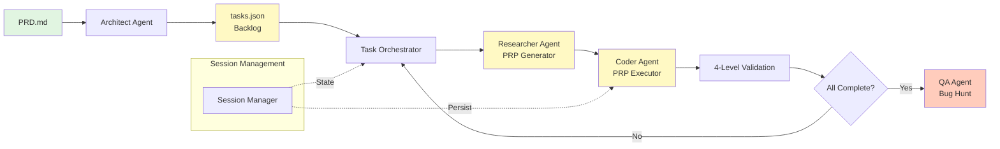
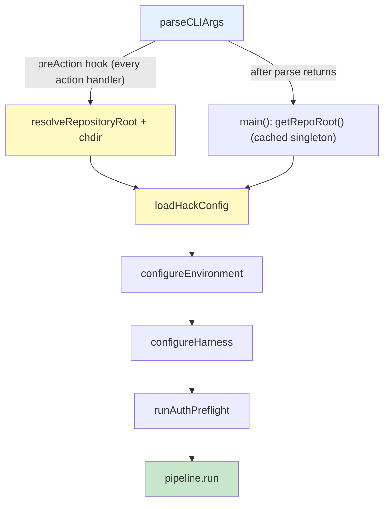
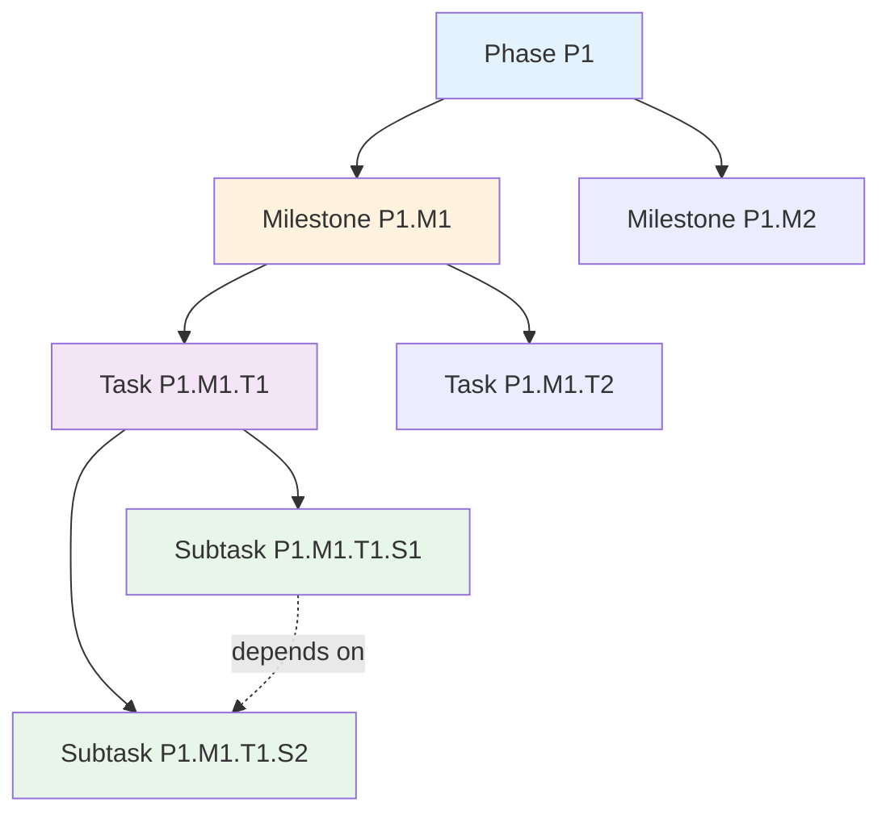
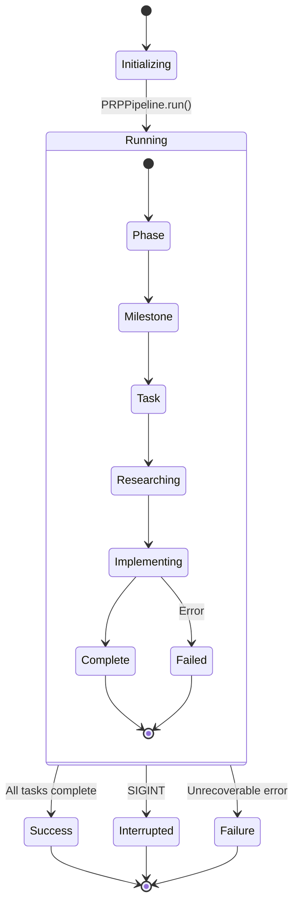
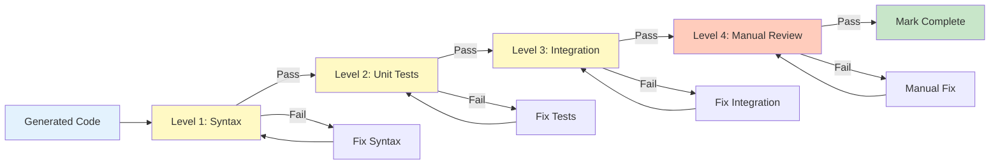
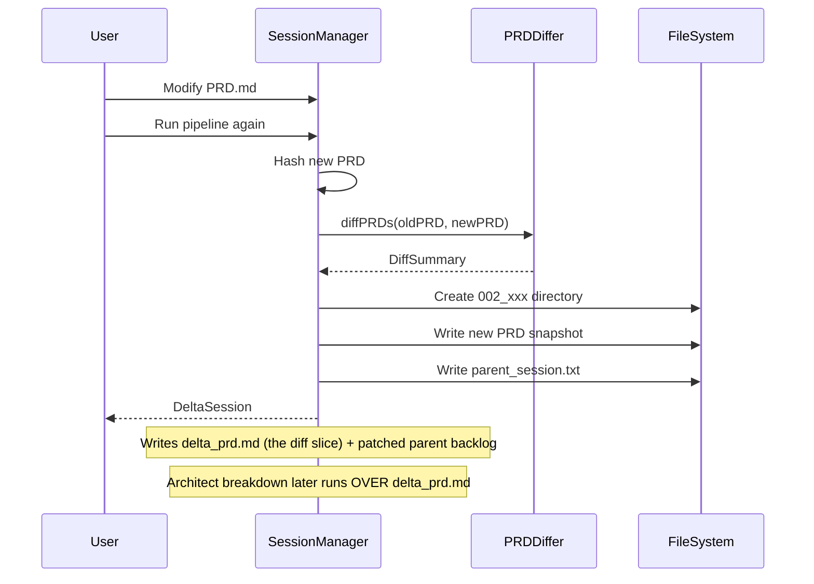
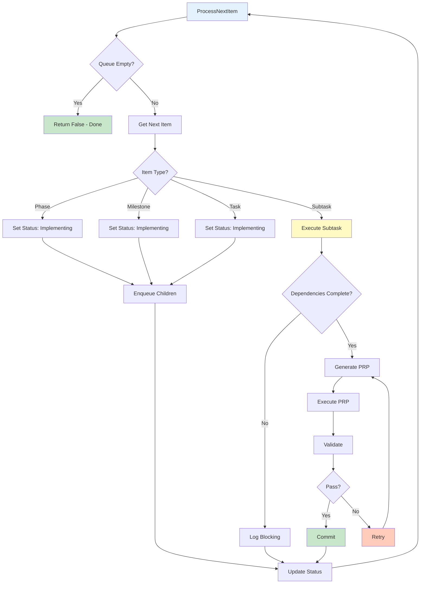
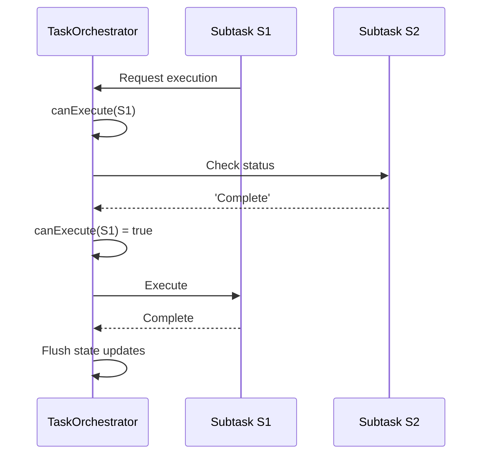
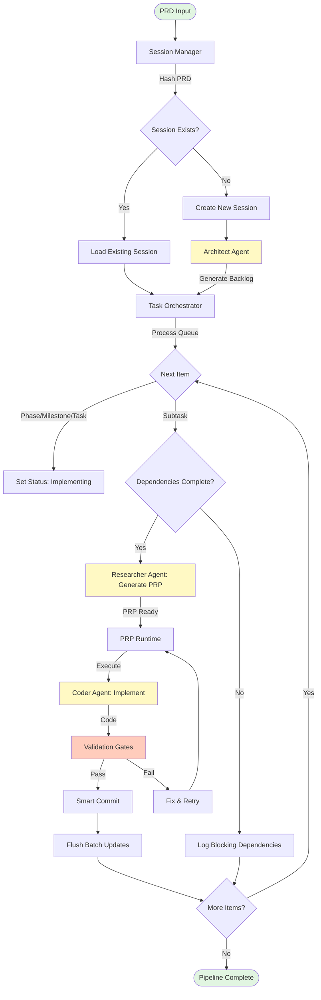

# Architecture Overview

> Comprehensive overview of the PRP Pipeline architecture, including system design, component interactions, Groundswell framework integration, multi-agent system, state management, and task execution flow.

**Status**: Published
**Last Updated**: 2026-07-25
**Version**: 1.0.1

---

## Table of Contents

- [System Overview](#system-overview)
- [Bootstrap Layer](#bootstrap-layer)
- [Resolved-Document Invariant (Distributed PRDs)](#resolved-document-invariant-distributed-prds)
- [Four Core Processing Engines](#four-core-processing-engines)
- [Groundswell Framework Integration](#groundswell-framework-integration)
- [Multi-Agent Architecture](#multi-agent-architecture)
- [Model Roles & Reasoning Budget](#model-roles--reasoning-budget)
- [State Management and Persistence](#state-management-and-persistence)
- [Task Hierarchy and Execution Flow](#task-hierarchy-and-execution-flow)
- [Adopt Mode (--adopt-prd)](#adopt-mode---adopt-prd)
- [See Also](#see-also)

---

## System Overview

The PRP Pipeline is an **autonomous AI-powered software development framework** that transforms Product Requirement Documents (PRDs) into implemented, tested, and polished codebases through agentic orchestration.

### Design Philosophy

The pipeline operates on four core principles:

1. **Structured Decomposition**: PRDs are decomposed into a four-level hierarchy (Phase > Milestone > Task > Subtask)
2. **Context-Dense Prompts**: Each subtask receives a focused Product Requirement Prompt (PRP) containing all necessary context
3. **Progressive Validation**: 4-level validation gates catch defects early (Syntax → Unit → Integration → Manual)
4. **Self-Healing**: Iterative bug hunting and fix cycles ensure quality

### High-Level Architecture



### System Flow Description

The PRP Pipeline follows a systematic flow from requirements to implementation:

1. **PRD Input**: A Product Requirement Document (PRD.md) provides the high-level requirements
2. **Architect Phase**: The Architect Agent analyzes the PRD and generates a hierarchical task backlog (tasks.json)
3. **Task Orchestration**: The Task Orchestrator manages the execution queue, traversing tasks in depth-first order
4. **Research Phase**: For each subtask, the Researcher Agent generates a comprehensive PRP with all necessary context
5. **Implementation Phase**: The Coder Agent executes the PRP, implementing the required code changes
6. **Validation**: Each implementation passes through 4-level validation gates (Syntax, Unit, Integration, Manual)
7. **QA Phase**: Once all tasks complete, the QA Agent performs a comprehensive bug hunt
8. **Fix Cycle**: If bugs are found, they trigger a fix cycle that re-executes affected tasks

Throughout the process, the Session Manager maintains state persistence, enabling resumable sessions and delta workflows.

---

## Bootstrap Layer

The **bootstrap layer** runs before any of the four processing engines (PRD §3, §8): it parses
the CLI, resolves and `chdir`s to the repository root **during** `program.parse()` (via a
`preAction` hook that fires before each action handler), loads the layered `.hack` configuration,
then configures the environment, harness, and auth preflight before the pipeline runs. Because
the `chdir` happens _inside_ parse — before every subcommand's `.action()` handler, not after
`parseCLIArgs()` returns — it is what makes "run from anywhere" work for **all** subcommands and
the default pipeline alike, and the committed `.hack` defaults work.

**Location**: [`src/cli/index.ts`](../src/cli/index.ts) (`parseCLIArgs()` registers the
`preAction` hook) + [`src/index.ts`](../src/index.ts) (`main()` reads the cached `getRepoRoot()`
singleton).



| Step | Action                                                                                                                                                                                                                                                                  | Source                                            | PRD §                    |
| ---- | ----------------------------------------------------------------------------------------------------------------------------------------------------------------------------------------------------------------------------------------------------------------------- | ------------------------------------------------- | ------------------------ |
| 1    | `parseCLIArgs()` registers a `program.hook('preAction', …)` and calls `program.parse()` — `--help`/`--version`/usage short-circuit here                                                                                                                                 | `src/cli/index.ts`                                | §4.1                     |
| 1a   | **`preAction` hook fires** (after options parsed, before each action body): `bootstrapRepoRoot(process.cwd(), {explicit?})` → `resolveRepositoryRoot` + `process.chdir(repoRoot)`; idempotent (`_bootstrapped`). Applies to the root default path AND every subcommand. | `src/cli/index.ts:852` + `src/utils/repo-root.ts` | §9.8.2 / §9.8.3 / §9.8.7 |
| 1b   | Subcommand `.action()` handlers run AFTER the chdir → they resolve `plan/`/`PRD.md`/`.hack`/`.env` at `repoRoot`.                                                                                                                                                       | `src/cli/index.ts`                                | §9.8.7 / §9.8.9          |
| 2    | `main()` reads the cached `getRepoRoot()` singleton (the chdir already ran during parse); `INVOCATION_CWD` was captured at module scope for `--prd` pre-resolution.                                                                                                     | `src/index.ts`                                    | §9.8                     |
| 3    | `PRD.md` exists-check against the now-correct cwd                                                                                                                                                                                                                       | `src/index.ts`                                    | §4.1                     |
| 4    | `loadHackConfig(repoRoot)` — 3-tier discovery + merge + env-seed                                                                                                                                                                                                        | `src/config/hack-config.ts`                       | §9.7 / §9.7.9            |
| 5    | `configureEnvironment()` — reads seeded + shell env                                                                                                                                                                                                                     | `src/index.ts`                                    | §9.2.1                   |
| 6    | `configureHarness()` (singular) + `runAuthPreflight()` + `ensureHarnessInitialized()`                                                                                                                                                                                   | `src/index.ts`                                    | §9.4 / §9.2.7            |
| 7    | `new PRPPipeline(...)` + `pipeline.run()`                                                                                                                                                                                                                               | `src/index.ts`                                    | §4.1                     |

> **Repo-root resolver** ([`src/utils/repo-root.ts`](../src/utils/repo-root.ts), PRD §9.8):
> walks upward from `INVOCATION_CWD` to the nearest `.git` entry — a **directory** (normal
> clone) **or a file** (worktree/submodule `gitdir:` pointer, §9.8.4) — and the **nearest
> ancestor wins** (an inner repo beats an outer one, §9.8.2). `realpathSync` canonicalizes the
> root. Reaching the filesystem root without a `.git` ancestor throws `NotARepositoryError`
> (§9.8.5), whose message bakes the `--repo-root <path>` remediation. `--repo-root` (§9.8.6)
> skips the walk and pins an explicit root. The resolve+`chdir` is wrapped in
> `bootstrapRepoRoot()` and invoked from the `preAction` hook so **all** subcommands inherit the
> correct cwd; a `NotARepositoryError` thrown in the hook propagates through `program.parse()` to
> `main().catch()`'s dedicated clean arm (single `❌` line, no stack trace). The resolved root is
> cached in module singletons
> (`getRepoRoot()` / `getInvocationCwd()`).
>
> **`.hack` loader** ([`src/config/hack-config.ts`](../src/config/hack-config.ts), PRD §9.7):
> three-tier discovery (global `~/.hack` / XDG → project `<repoRoot>/.hack` committable →
> project-local `<repoRoot>/.hack.local` gitignored, §9.7.3), merged lowest-to-highest. It loads
> **after** the `chdir` (project files live at `repoRoot`) and **before** `configureEnvironment()`
> (§9.7.9) so seeded values are visible to the env resolver. The env-over-file rule (§9.2.1)
> means merged file values seed `process.env` **only** for `undefined` keys — real shell env,
> even empty, still wins. Committable tiers refuse secret-bearing keys (hard error, §9.7.6);
> `.hack.local` is the only secrets-allowed tier.

For the full `.hack` schema, see
[Configuration → .hack Configuration File](./CONFIGURATION.md#hack-configuration-file)
(ARCHITECTURE.md does not duplicate that table). For harness configuration, see
[Agent Creation](#agent-creation) below.

---

## Resolved-Document Invariant (Distributed PRDs)

A PRD of any real size may be authored across multiple files (architecture, API, data model, companion docs) and assembled into **one canonical document** at load time (PRD §2.3). An `@path/to/file.md` token is an _include directive_ — it is replaced inline by the referenced file's UTF-8 contents.

### Expansion Rules

A token expands only when **both** conditions hold:

1. **Boundary** — the `@` is at the start of a line _or_ preceded by a non-path character, so `foo@bar.com` and mid-word `@` are left literal.
2. **Existence** — the path resolves to an existing **file** (directories and missing paths stay verbatim and silent).

Includes resolve **project-root-relative** (relative to the entry PRD's directory) and expand **recursively, with cycle detection**, up to `PRD_INCLUDE_MAX_DEPTH` (default `10`). Re-resolution is **idempotent** — identical input bytes yield identical resolved bytes.

When `PRD_INCLUDE_MARKERS` is set, resolved output emits `<!-- @!include: path -->` / `<!-- @!end-include -->` markers around expanded includes; a `.md` token that fails to resolve (a _stale include_) emits a warning on stderr.

### The Invariant: One Canonical Document Downstream

Everything downstream operates over the **fully-resolved, include-expanded document**, never the raw entry file:

- **Hashing** — the session hash (PRD §4.1 step 2) is computed over the resolved document, so `hash === prd_snapshot.md` bytes.
- **`prd_snapshot.md`** — written from the resolved document.
- **Delta detection** — delta sessions key off the resolved hash (PRD §4.3).
- **Delta-PRD inputs** — the PRD slice fed to the Architect on a delta run is resolved.
- **Agent prompts** — integration, validation, and bug-finder prompts embed resolved content; the prompts explicitly state the text is the _complete merged document_, so agents never chase includes themselves.
- **`prd_selectors` / mdsel indexing** — section indexing runs over a materialized resolved copy (`prd_snapshot.md`) (PRD §4.2).

The resolver is `resolvePRD(prdPath)` in [`src/core/session-utils.ts`](../src/core/session-utils.ts). See [Configuration → Distributed PRDs](./CONFIGURATION.md#distributed-prds) for the include-expansion environment knobs.

---

## Four Core Processing Engines

The PRP Pipeline's architecture is built around four interconnected processing engines that handle different aspects of the development lifecycle.

### 1. Session Manager

**Location**: [`src/core/session-manager.ts`](../src/core/session-manager.ts)

The Session Manager provides centralized state management, PRD hash-based initialization, and delta session capabilities.

#### Responsibilities

- **Session State Management**: Maintains immutable `SessionState` with metadata, PRD snapshot, and task registry
- **PRD Hashing**: Computes SHA-256 hashes for change detection
- **Session Discovery**: Finds existing sessions by hash or creates new ones
- **Delta Sessions**: Creates linked sessions when PRDs are modified
- **Atomic Persistence**: Batch writes with dirty flag for efficient state updates

##### Resolved-document invariant

The session hash and `prd_snapshot.md` are computed over the fully-resolved, include-expanded PRD — see [Resolved-Document Invariant (Distributed PRDs)](#resolved-document-invariant-distributed-prds) for the full capability framing (PRD §2.3).

#### Key Methods

```typescript
// Initialize session (new or load existing)
async initialize(): Promise<SessionState>

// Create delta session for PRD changes
async createDeltaSession(newPRDPath: string): Promise<DeltaSession>

// Update item status with batching
async updateItemStatus(itemId: string, status: Status): Promise<Backlog>

// Flush accumulated updates atomically
async flushUpdates(): Promise<void>
```

#### Session Directory Structure

```text
plan/
├── 001_14b9dc2a33c7/
│   ├── prd_snapshot.md          # Original PRD content
│   ├── tasks.json               # Task backlog registry
│   └── parent_session.txt       # Parent reference (delta sessions only)
├── 002_a1b2c3d4e5f6/
│   └── ...
```

---

### 2. Task Orchestrator

**Location**: [`src/core/task-orchestrator.ts`](../src/core/task-orchestrator.ts)

The Task Orchestrator manages backlog processing with recursive depth-first traversal (DFS) and dependency-aware execution.

#### Responsibilities

- **Backlog Traversal**: DFS pre-order traversal (Phase → Milestone → Task → Subtask)
- **Dependency Resolution**: Ensures subtasks execute only after dependencies complete
- **Scope Support**: Executes subsets of the backlog (milestone, task, subtask scope)
- **Status Management**: Transitions items through lifecycle states
- **Smart Commits**: Creates git commits after each successful subtask

#### Key Methods

```typescript
// Process next item from execution queue
async processNextItem(): Promise<boolean>

// Check if subtask can execute (dependencies satisfied)
canExecute(subtask: Subtask): boolean

// Get blocking dependencies
getBlockingDependencies(subtask: Subtask): Subtask[]

// Wait for dependencies to complete
async waitForDependencies(subtask: Subtask, options?: { timeout?: number; interval?: number }): Promise<void>
```

#### Task Hierarchy



#### Dependency Resolution

Subtasks declare dependencies using the `dependencies` array:

```typescript
interface Subtask {
  readonly dependencies: string[]; // e.g., ['P1.M1.T1.S1', 'P1.M1.T1.S2']
}
```

The orchestrator validates dependencies before execution and blocks execution if prerequisites are not complete.

---

### 3. Agent Runtime

**Location**: [`src/agents/prp-runtime.ts`](../src/agents/prp-runtime.ts)

The Agent Runtime manages LLM agent creation, configuration, and execution with tool registration and context injection.

#### Responsibilities

- **Agent Factory**: Creates agents for different personas (Architect, Researcher, Coder, QA)
- **Tool Registration**: Provides file I/O, shell, search, and web research tools
- **Context Injection**: Injects relevant codebase context into agent prompts
- **PRP Execution**: Orchestrates PRP generation and execution
- **Validation Gates**: Manages 4-level validation process

#### Agent Types

Each persona maps to a model **role** (research / reasoning / implementation) that selects the model **tier** via `ROLE_CONFIG` (the single source of truth for the **model** in [`src/agents/agent-factory.ts`](../src/agents/agent-factory.ts)). The **reasoning level** is a separate axis — resolved **per agent-identity** from `PRP_REASONING_*` (PRD §9.2.9), independent of the tier; tuning one axis never perturbs the other. Tier names are `high` / `balanced` / `fast`. See [Model Roles & Reasoning Budget](#model-roles--reasoning-budget) for the role→tier and per-identity level contract.

| Persona        | Role           | Tier (model)         | Reasoning level (default)                           | Responsibility                        | Token Limit |
| -------------- | -------------- | -------------------- | --------------------------------------------------- | ------------------------------------- | ----------- |
| **Architect**  | Reasoning      | balanced (`glm-5.2`) | `high` (`PRP_REASONING_BREAKDOWN_AGENT`)            | Decompose PRD into task backlog       | 8192        |
| **Researcher** | Research       | balanced (`glm-5.2`) | `high` (`PRP_REASONING_AGENT`)                      | Generate PRPs for subtasks            | 4096        |
| **Coder**      | Implementation | fast (`glm-5-turbo`) | `off` (`PRP_REASONING_IMPL_AGENT`)                  | Execute PRPs to produce code          | 4096        |
| **QA**         | Reasoning      | balanced (`glm-5.2`) | `high` — split (bug-finder / validation; see below) | Validate + bug-hunt (default `pizr`)  | 4096        |
| **Cleanup**    | Implementation | fast (`glm-5-turbo`) | `off` (hardcoded; not a §9.2.9 role)                | Post-validation doc reorg (stateless) | 4096        |

#### Tool System

```typescript
interface MCPTool {
  name: string;
  description: string;
  inputSchema: z.ZodType<any>;
  handler: (input: unknown) => Promise<ToolResult>;
}
```

Available tools:

- **BashMCP**: Execute shell commands
- **FilesystemMCP**: Read/write files
- **GitMCP**: Git operations
- **SearchMCP**: Codebase search
- **WebFetch**: Web research

---

### 4. Pipeline Controller

**Location**: [`src/workflows/prp-pipeline.ts`](../src/workflows/prp-pipeline.ts)

The Pipeline Controller orchestrates the entire development lifecycle from PRD to implemented code.

#### Responsibilities

- **Workflow Orchestration**: Coordinates all processing engines
- **Error Recovery**: Handles failures gracefully with retry logic
- **Graceful Shutdown**: Responds to SIGINT (Ctrl+C) with state preservation
- **Progress Tracking**: Reports completion metrics and duration
- **Session Resumption**: Continues interrupted sessions

#### Execution Flow



---

## Groundswell Framework Integration

The PRP Pipeline is built on the **Groundswell Framework**, which provides agentic workflow primitives.

### @Workflow Decorator

The main pipeline workflow extends the Groundswell `Workflow` class:

```typescript
import { Workflow, Step, ObservedState } from 'groundswell';

class PRPPipeline extends Workflow {
  @ObservedState()
  currentPhase: string = 'init';

  @Step({ trackTiming: true, snapshotState: true })
  async initializeSession(): Promise<SessionConfig> {
    this.currentPhase = 'initializing';
    return sessionConfig;
  }
}
```

The `@Workflow` decorator provides:

- **Automatic state observation**: Track workflow state changes
- **Step timing**: Measure execution time for each step
- **State snapshots**: Save state at key points for recovery
- **Error handling**: Built-in retry and failure handling

### @Step Decorator

Individual workflow steps use the `@Step` decorator:

```typescript
@Step({ trackTiming: true, snapshotState: true })
async executePhase(): Promise<void> {
  // Step implementation
}
```

Step decorator options:

- `trackTiming`: Record execution time for performance analysis
- `snapshotState`: Save state before/after step execution
- `retry`: Number of retry attempts on failure
- `timeout`: Maximum execution time before aborting

### @ObservedState Pattern

State properties use the `@ObservedState()` decorator:

```typescript
@ObservedState()
currentItemId: string | null = null;

@ObservedState()
totalItems: number = 0;
```

Observed state provides:

- **Automatic persistence**: State changes are persisted automatically
- **Change detection**: Framework detects when state changes
- **Recovery support**: State can be restored after interruption

### Agent Creation

Agents are created using Groundswell's `createAgent` function. At startup the
pipeline first configures the **harness** — the agent runtime/SDK — via
`configureHarnesses()`, selecting the runtime (`pi`, the vendor-neutral
default, or `claude-code`) **independently** of the LLM **provider/model**
(default `zai`). See the [Groundswell Guide](./GROUNDSWELL_GUIDE.md) and
PRD §9.4.

```typescript
import { configureHarnesses, createAgent } from 'groundswell';

// 1. Configure the harness once at startup (harness ⟂ provider/model).
configureHarnesses({
  defaultHarness: 'pi', // vendor-neutral default (pi.dev); 'claude-code' is Anthropic-only
  defaultModelProvider: 'zai', // LLM host — independent of the harness
  harnessDefaults: {
    'claude-code': { apiKey: process.env.ANTHROPIC_API_KEY },
  },
});

// 2. Create an agent. Models are provider-qualified ('zai/glm-5.2'), never
//    harness-qualified ('pi/zai/glm-5.2' is invalid). Auth is resolved
//    provider-aware (override → provider env var → ~/.pi/agent/auth.json);
//    the default path passes no top-level apiKey.
const coderAgent = createAgent({
  model: 'zai/glm-5.2', // default reasoning tier (PRD §9.2.3)
  maxTokens: 8192,
  systemPrompt: CODER_SYSTEM_PROMPT,
});

const response = await coderAgent.generate({
  prompt: 'Implement the PRP',
  tools: [bashTool, fileTool, gitTool],
  responseFormat: { type: 'text' },
});
```

### Tool Registration

MCP tools are registered with agents through Groundswell:

```typescript
import { MCPHandler } from 'groundswell';

const mcp = new MCPHandler();

// Register custom tools
mcp.registerTool({
  name: 'execute_command',
  description: 'Execute shell command',
  inputSchema: z.object({
    command: z.string(),
  }),
  handler: async input => {
    return { output: await exec(input.command) };
  },
});

// Use with agent
const response = await agent.generate({
  prompt: 'List files',
  tools: mcp.getTools(),
});
```

### Groundswell Caching

Groundswell provides automatic SHA-256 based caching:

```text
Cache Key = SHA-256(system prompt + user prompt + responseFormat)
```

**Performance Impact**:

- **Cache Hit**: <10ms, 0 API calls
- **Cache Miss**: 1-5 seconds, 1 API call
- **Typical Hit Rate**: 80-95% on subsequent runs

---

## Multi-Agent Architecture

The PRP Pipeline uses specialized AI agents for each stage of development, with distinct personas and responsibilities.

### Agent Personas

| Agent          | Persona               | Purpose                  | Input           | Output          | Invoked When       |
| -------------- | --------------------- | ------------------------ | --------------- | --------------- | ------------------ |
| **Architect**  | System Designer       | Decompose PRD into tasks | PRD.md          | tasks.json      | New session        |
| **Researcher** | Context Gatherer      | Generate PRPs            | Subtask context | PRP.md          | Subtask starts     |
| **Coder**      | Implementation Expert | Implement PRPs           | PRP.md          | Code changes    | PRP generated      |
| **QA**         | Quality Assurance     | Find bugs                | Completed code  | TEST_RESULTS.md | All tasks complete |

### Prompt Engineering

Each agent has a specialized system prompt that defines its persona and approach:

**Architect Prompt** (from PROMPTS.md):

```text
# LEAD TECHNICAL ARCHITECT & PROJECT SYNTHESIZER

> ROLE: Act as a Lead Technical Architect and Project Management Synthesizer.
> CONTEXT: You represent the rigorous, unified consensus of a senior panel (Security, DevOps, Backend, Frontend, QA).
> GOAL: Validate the PRD through research, document findings, and decompose the PRD into a strict hierarchy: Phase > Milestone > Task > Subtask.
```

**Researcher Prompt**:

Focused on codebase analysis and context gathering for PRP generation. Spawns subagents for parallel research.

**Coder Prompt**:

Executes PRPs with strict adherence to validation gates and existing codebase patterns.

**QA Prompt**:

Performs comprehensive bug hunting with creative testing approaches.

### Tool System (MCP)

Agents interact with the codebase through Model Context Protocol (MCP) tools:

#### BashMCP

Execute shell commands for build, test, and git operations:

```typescript
await bashTool.execute({
  command: 'npm test',
  timeout: 30000,
});
```

#### FilesystemMCP

Read and write files with path validation:

```typescript
const content = await fileTool.read({ path: 'src/index.ts' });
await fileTool.write({ path: 'src/new-file.ts', content: '...' });
```

#### GitMCP

Git operations for commit and diff:

```typescript
const status = await gitTool.status({ path: '.' });
await gitTool.commit({ message: 'Implement feature X' });
```

### Validation Gates

Each PRP execution goes through 4 validation gates:



**Level 1: Syntax & Style**

- Linting (ESLint)
- Type checking (TypeScript)
- Code formatting (Prettier)

**Level 2: Unit Tests**

- Component-level tests
- Edge case coverage
- Mock external dependencies

**Level 3: Integration Tests**

- Service startup validation
- Endpoint testing
- Database operations

**Level 4: Manual/E2E**

- User workflow testing
- Creative edge cases
- Adversarial testing

**Gate Semantics (PRD §9.9).** Validation gates are _monotonic terminal-state assertions_: once
true against the final filesystem state, they stay true. `PRPExecutor.#runValidationGates()` re-runs
**every** gate as a single batch against that final tree (not the incremental order the coder ran
during its turn). Negative file-existence gates are **forbidden at construction** (REQ-G1: G1.1–G1.5)
and **neutralized at runtime** (REQ-G2: G2.1–G2.3): a negated-existence gate (`! test -f X`,
`test ! -f X`, `[ ! -f X ]`, `! [ -f X ]`) is marked `skipped: true / success: true` with a logged
reason citing §9.9, while negated _content_ gates (`! grep …`) execute normally. This repairs
cached/legacy PRPs without regeneration.

---

## Model Roles & Reasoning Budget

The pipeline uses **three separate model roles** so cost, speed, and reasoning depth can be tuned per phase (PRD §9.2.3 / §6.1). The two are **orthogonal axes**: the role→tier **model** mapping is driven by `ROLE_CONFIG` in [`src/agents/agent-factory.ts`](../src/agents/agent-factory.ts) — the single source of truth for the model, **unchanged** by §9.2.9; the **reasoning level** is resolved **per agent-identity** from `PRP_REASONING_<ROLE>` (PRD §9.2.9), independent of the tier. Tuning a model tier never perturbs the reasoning level, and vice versa.

| Role               | Tier     | Reasoning level                                    | Pipeline agents                                                         |
| ------------------ | -------- | -------------------------------------------------- | ----------------------------------------------------------------------- |
| **Research**       | balanced | per-identity (research) — see table below          | Researcher — PRP creation & architecture research                       |
| **Reasoning**      | balanced | per-identity (breakdown / bug-finder / validation) | Architect (decomposition), QA (validation + bug-finder, default `pizr`) |
| **Implementation** | fast     | per-identity (implementation) — `off` by default   | Coder (PRP execution / fix), Cleanup (doc reorg)                        |

The reasoning level is resolved per agent-identity (the granularity §9.2.9 introduced), not per model role:

| Agent identity | Env var                          | Default | Resolved by                |
| -------------- | -------------------------------- | ------- | -------------------------- |
| Research / PRP | `PRP_REASONING_AGENT`            | `high`  | `getReasoningAgent()`      |
| Breakdown      | `PRP_REASONING_BREAKDOWN_AGENT`  | `high`  | `getReasoningBreakdown()`  |
| Bug finder     | `PRP_REASONING_BUG_FINDER_AGENT` | `high`  | `getReasoningBugFinder()`  |
| Validation     | `PRP_REASONING_VALIDATION_AGENT` | `high`  | `getReasoningValidation()` |
| Implementation | `PRP_REASONING_IMPL_AGENT`       | `off`   | `getReasoningImpl()`       |

- **Research role** — architecture research and PRP creation. Balanced tier; research identity resolves `PRP_REASONING_AGENT` (default `high`). Canonical env var `PRP_MODEL_BALANCED` (default `glm-5.2`).
- **Reasoning role** — task decomposition, creative bug-finding, and validation. Balanced tier; the breakdown, bug-finder, and validation identities each resolve their own `PRP_REASONING_*` (all default `high`). PRD §9.2.9 moved these from a hard `xhigh` pin to a **configurable `high` default** — `xhigh` remains available via explicit config. Personas: Architect (breakdown) and QA (bug-finder/validation). Canonical env var `PRP_MODEL_BALANCED`.
- **Implementation role** — code-writing (PRP execution, post-validation fix, cleanup). Fast tier; implementation identity resolves `PRP_REASONING_IMPL_AGENT` (default `off`). Canonical env var `PRP_MODEL_FAST` (default `glm-5-turbo`).

**QA persona split.** `createQAAgent(reasoningLevel)` is shared by **four** callers. Bug-finder ([`bug-hunt-workflow.ts`](../src/workflows/bug-hunt-workflow.ts)) and validation ([`validation-workflow.ts`](../src/workflows/validation-workflow.ts)) resolve **distinct** levels via their own getters. Delta-analysis ([`delta-analysis-workflow.ts`](../src/workflows/delta-analysis-workflow.ts)) and change-classification ([`change-classifier.ts`](../src/core/change-classifier.ts) — `classifyChange` / `classifyArtifact`) are **research-leaning** — they perform PRD-diff / artifact analysis rather than adversarial bug-hunting or contract validation — so they resolve to the research role's level (`PRP_REASONING_AGENT`).

**Auxiliary factories.** `createCleanupAgent` and `createCommitMessageAgent` are **not** §9.2.9 roles; they hardcode `thinking: 'off'` (mechanical / single-shot), so tuning the five `PRP_REASONING_*` knobs never surprises them.

### How `thinking` is wired

The resolved level is validated and stored on `AgentConfig.thinking` as a **pipeline-internal marker**. Groundswell's `createAgent` does not consume it (`HarnessOptions` has no `thinking` / `thinkingLevel` field), so harness-side wiring (`pi --thinking <level>` / claude-code `maxThinkingTokens`) is a **cross-repo dependency** that is out of scope for §9.2.9 — noted here, not implemented in this repo. The valid levels are the canonical `ReasoningLevel` vocabulary: `'off' | 'minimal' | 'low' | 'medium' | 'high' | 'xhigh'` (`ThinkingLevel` is now an alias of `ReasoningLevel`).

### Model strings are provider-qualified

Models are read at runtime (never hardcoded) and are **provider-qualified** (`zai/glm-5.2`), **never harness-qualified** (`pi/zai/glm-5.2` is invalid). The harness (`pi` / `claude-code`) is selected independently of the provider/model at startup — see [Groundswell Framework Integration](#groundswell-framework-integration) and PRD §9.4.

### Canonical ↔ legacy environment variables

The canonical tier names are primary (`PRP_MODEL_HIGH`, `PRP_MODEL_BALANCED`, `PRP_MODEL_FAST`), defaulting to `glm-5.2` / `glm-5.2` / `glm-5-turbo` respectively. The tier names were **renamed** from an earlier legacy scheme to the current `high` / `balanced` / `fast` scheme (default model values are unchanged). When a canonical var is unset, the loader falls back to the matching **legacy alias** and emits a **one-time deprecation warning** per legacy var (slated for future removal, PRD §9.2.8). The exact legacy names and the full canonical↔legacy mapping live in [Configuration → Deprecation (legacy aliases)](./CONFIGURATION.md#deprecation-legacy-anthropic-aliases) — ARCHITECTURE.md does not duplicate that table.

> **bash-pipeline equivalence (cross-ref only):** research = `pi`, reasoning = `pizr` (`pi --thinking xhigh`), implementation = `piznt` (PRD §9.2.3). In the TypeScript rewrite these map to the Architect/Researcher/Coder/QA/Cleanup personas above.

See [Configuration → Model Roles](./CONFIGURATION.md#model-roles) for the full environment-variable table.

---

## State Management and Persistence

The PRP Pipeline uses a robust state management system with immutable data structures and atomic persistence. It also self-heals `tasks.json` corruption automatically after every agent run — see [tasks.json Protection & Smart Recovery](#tasksjson-protection--smart-recovery).

### Session Directory Structure

```text
plan/
├── 001_14b9dc2a33c7/              # First session (sequence + hash)
│   ├── prd_snapshot.md             # Original PRD content
│   ├── tasks.json                  # Task backlog registry
│   ├── parent_session.txt          # Parent reference (delta sessions only)
│   └── bugfix/                     # Numbered bug-hunt iterations (PRD §4.4 / §5.1)
│       ├── 001_<12hexhash>/        # 1st bug-hunt iteration (archived, not overwritten)
│       │   ├── tasks.json
│       │   ├── prd_snapshot.md
│       │   └── ...                 # fix subtasks + TEST_RESULTS.md
│       └── 002_<12hexhash>/        # 2nd iteration (prior iteration preserved)
│           ├── tasks.json
│           └── ...
├── 002_a1b2c3d4e5f6/              # Delta session (PRD modified)
│   ├── prd_snapshot.md             # Updated PRD
│   ├── tasks.json                  # New task registry
│   ├── parent_session.txt          # "001_14b9dc2a33c7"
│   └── subtasks/                   # Generated PRPs (optional)
│       ├── P1.M1.T1.S1.md
│       ├── P1.M1.T1.S2.md
│       └── ...
└── .gitignore                      # Exclude generated files

> Each bug-hunt iteration that finds bugs gets a new numbered child under `bugfix/`
> via `nextBugfixDir()` (`bugfix/001_<hash>/`, `bugfix/002_<hash>/`, …). Prior
> iterations are archived on disk so the audit trail is preserved — the full
> session-path shape is `plan/NNN_<hash>/bugfix/NNN_<hash>/` (PRD §5.1).
```

### tasks.json Format

The task registry is a JSON document representing the four-level hierarchy:

```json
{
  "backlog": [
    {
      "type": "Phase",
      "id": "P1",
      "title": "Foundation",
      "status": "Complete",
      "description": "Core infrastructure and documentation",
      "milestones": [
        {
          "type": "Milestone",
          "id": "P1.M1",
          "title": "Project Setup",
          "status": "Complete",
          "description": "Initialize project structure",
          "tasks": [
            {
              "type": "Task",
              "id": "P1.M1.T1",
              "title": "Developer Documentation",
              "status": "Complete",
              "description": "Create comprehensive developer docs",
              "subtasks": [
                {
                  "type": "Subtask",
                  "id": "P1.M1.T1.S1",
                  "title": "Create Architecture Overview",
                  "status": "Complete",
                  "story_points": 2,
                  "dependencies": [],
                  "context_scope": "Create docs/ARCHITECTURE.md with system overview..."
                }
              ]
            }
          ]
        }
      ]
    }
  ]
}
```

### PRD Hash-Based Change Detection

The pipeline uses SHA-256 hashing to detect PRD changes:

```typescript
import { createHash } from 'crypto';

function computePRDHash(prdPath: string): string {
  const content = fs.readFileSync(prdPath, 'utf-8');
  return createHash('sha256').update(content).digest('hex').substring(0, 12);
}
```

**Session ID Format**: `{sequence}_{hash}`

- `sequence`: Auto-incrementing number (001, 002, 003, ...)
- `hash`: First 12 characters of SHA-256 hash

**Behavior**:

- Same hash → Load existing session
- Different hash → Create new session
- Modified PRD → classified COSMETIC or SUBSTANTIVE by the change classifier (protective default **SUBSTANTIVE**, see [Configuration](CONFIGURATION.md#resilience-tuning) for `CLASSIFIER_RETRY_MAX`):
  - **SUBSTANTIVE** → Create delta session with parent reference
  - **COSMETIC** → Absorbed as the new baseline (`prd_snapshot.md` + `metadata.hash` refreshed) **without** a delta session

### Delta Sessions

When a PRD is modified, the pipeline creates a delta session linked to the original:



The delta session writes `delta_prd.md` (the structured diff slice) and saves
the patched parent backlog. `decomposePRD()` then runs the architect breakdown
**over `delta_prd.md`** (not the full PRD), decomposing **added** requirements
into new `Phase → Milestone → Task → Subtask` items and **merging** them with the
patched statuses from `patchBacklog` (`modified → Planned`, `removed → Obsolete`).
Previously this breakdown path was unreachable (it was gated behind a
`hasBacklog` early-return), so added requirements were silently dropped; the
fix (Issue 1/2) checks `isDelta` _before_ `hasBacklog` and merges the freshly
decomposed tasks with the patched backlog. (PRD §4.3 step 5/6.) Added
requirements are also **preserved on ID collision**: the architect numbers fresh
from `P1` every run, so its newly-decomposed IDs routinely collide with the
patched ID space; such colliding items are **renumbered-and-appended** (unique,
hierarchy-consistent IDs derived from parent context) rather than dropped, so no
added requirement is ever lost (PRD §4.3 step 6).

**Delta Session Properties**:

- **Linked**: Contains `parent_session.txt` with parent path
- **Incremental**: Re-executes affected tasks AND decomposes newly-added requirements into new tasks
- **Efficient**: Skips completed work unaffected by changes

### State Persistence Patterns

**Immutable State with Batch Updates**:

```typescript
interface SessionState {
  readonly metadata: SessionMetadata;
  readonly prdSnapshot: string;
  readonly taskRegistry: Backlog;
  currentItemId: string | null; // Mutable for batching
}
```

**Update Pattern**:

```typescript
// 1. Accumulate updates in memory
sessionManager.updateItemStatus('P1.M1.T1.S1', 'Implementing');
sessionManager.updateItemStatus('P1.M1.T1.S1', 'Complete');

// 2. Flush atomically
await sessionManager.flushUpdates();
```

**Atomic Persistence**:

- All changes batched in memory
- Single write operation on flush
- Prevents partial state corruption

### tasks.json Protection & Smart Recovery

Agents routinely corrupt `tasks.json` despite the forbidden-operations rules — truncated writes, partial edits, or schema-invalid mutations. The pipeline survives this without human intervention via **smart recovery** (PRD §5.1), invoked by the orchestrator after every agent run.

**Re-apply the legitimate delta.** After each agent invocation the orchestrator re-reads `tasks.json` from disk and re-applies **only** the legitimate status change from that run (the item just implemented or interrupted), discarding any other unauthorized mutations the agent made. Reconstruction is performed from the orchestrator's pre-agent in-memory backlog snapshot so unrelated status scribbles are dropped.

**Recover from corruption.** If `tasks.json` fails to parse or validate, the system walks git commit history (prior versions of the file), locates the last valid JSON, restores it, then re-applies any in-flight status changes on top.

**Preserve background-research status.** Items marked `Researching` or `Retrying` survive a restore — they are carried forward from the restored version and never dropped back to `Planned`. (There is no `Ready` status; readiness is tracked internally by the research queue.)

**Non-fatal.** A single corrupting agent never terminates the session. If no valid version can be recovered, the failure is logged and on-disk state is left as-is; recovery always returns a typed result for observability and never throws to the caller.

```typescript
import { recoverTasksJson } from './core/tasks-json-recovery.js';

// After each agent run, in the orchestrator:
const result = await recoverTasksJson(
  sessionTasksPath,
  { itemId: currentItem.id, status: 'Complete' },
  { baselineBacklog: this.backlog, repoPath: process.cwd() }
);
// result: { restored: boolean; source: 'disk' | 'git'; reason?: string }
```

### Two-Phase Commit (Per-Item Survival)

Each subtask commits in **two phases** via the Smart Commit tool — `stagecoach` — which delegates commit-message authorship to an LLM with bounded retry + exponential backoff and a last-resort placeholder fallback (honoring smartCommit's never-fail-on-commit contract) (PRD §4.2 step 4):

1. **Pre-cleanup _survival_ commit** — _before_ the long, interruptible cleanup agent runs, the orchestrator commits the item's substance: source changes + its `plan/` work directory + its `Complete` status. Committing before cleanup **guarantees** a force-interrupt during cleanup can no longer leave an item "Complete on disk but uncommitted" — the state that orphans `plan/` directories forever (the cleanup agent is forbidden from touching `plan/`).
2. **Post-cleanup commit** — _after_ cleanup reorganizes docs (temp artifacts removed, docs moved to `docs/`), a second `stagecoach` commit records the doc reorganization. It runs only when cleanup succeeded.

This complements [tasks.json Protection & Smart Recovery](#tasksjson-protection--smart-recovery): recovery survives `tasks.json` _corruption_; the two-phase commit survives _interruption_ mid-item.

### Commit Message Format (Two-Layer Model)

A generated commit message is governed by **two orthogonal layers**, resolved independently: the `stagecoach` agent first authors the **descriptive message** under the style contract, then `formatCommitMessage` wraps the **position** prefix around it. The legacy `[PRP Auto]` banner is never emitted (PRD §5.1).

| Layer    | Toggle              | Default       | Controls                                      |
| -------- | ------------------- | ------------- | --------------------------------------------- |
| Position | `PRP_COMMIT_FORMAT` | `task-prefix` | Whether/how the item's position is prepended  |
| Style    | `PRP_COMMIT_STYLE`  | `auto`        | The wording of the descriptive message itself |

**Position layer (unchanged).** `PRP_COMMIT_FORMAT=task-prefix` (default) prepends the item's 1-indexed `<phase>.<milestone>.<task>.<subtask>:` position, eliding trailing levels the item does not use (`1.2.1`, never `1.2.1.0`); non-backlog commits (initial, fallback, scaffolding) carry no prefix, and `PRP_COMMIT_FORMAT=plain` opts out entirely. This layer never touches the wording of the descriptive message. The `Co-Authored-By: Claude <noreply@anthropic.com>` trailer is **preserved** on every commit in both modes.

**Style layer.** `PRP_COMMIT_STYLE` governs the descriptive message `stagecoach` actually writes — its tone, length, and whether it carries a Conventional-Commit type/scope or a gitmoji:

- `auto` (default) **learns from history**: the generation request includes the last `PRP_COMMIT_STYLE_EXAMPLES` (default 5) commit messages as verbatim **style examples**, with a hard anti-reuse instruction (match the examples' style — format, tone, length, prefix/emoji — but produce entirely original wording for this change) and an instruction to **ignore any leading numeric position prefix** in the examples (that marker is added by the position layer, not part of the style). A repo with ≤1 commit — or `PRP_COMMIT_STYLE_EXAMPLES=0` — has nothing to learn, so `auto` degrades to the `plain` contract.
- `plain` — imperative summary, ≤72-char subject, no type prefix, no scope, no emoji (the prior fixed prompt, promoted to a named mode; also the `auto` fallback).
- `conventional` — `type(scope): description` from the standard Conventional-Commits vocabulary; scope optional.
- `gitmoji` — the subject begins with exactly one gitmoji (the emoji character, not a `:shortcode:`), followed by a space and the description.

An explicit (non-`auto`) mode **replaces** the style-examples block with that mode's contract; history is consulted only under `auto`. The agent's system prompt is built dynamically from the resolved mode (the former hardcoded prompt is the `plain` contract). In every mode the agent emits ONLY the descriptive message — never a position prefix, the `[PRP Auto]` banner, or the `Co-Authored-By` trailer (those remain `formatCommitMessage`'s job).

**Interaction between the layers.** Both layers apply in sequence and independently. When a prefix-producing style (`conventional`, `gitmoji`) is combined with `PRP_COMMIT_FORMAT=task-prefix`, **both prefixes render** and the subject takes the form `<position>: type(scope): description` (or `<position>: <emoji> description`) — the descriptive message is still kept verbatim. A team that wants a clean Conventional-Commit or gitmoji history sets `PRP_COMMIT_FORMAT=plain` so the position layer does not double up. (Under `auto`, the same double-up can occur when the learned style is conventional/gitmoji — that is the project's own voice being matched, and the same `plain` remedy applies.) Toggling either layer affects only newly generated messages; existing history is never rewritten.

See [Configuration](CONFIGURATION.md#resilience-tuning) for the env-var flags and `.hack` keys.

### State Integrity Protections

Beyond smart recovery and the two-phase commit, the pipeline layers several explicit integrity guards (PRD §5.1 / §4.4 / §9.3.2):

- **flock-guarded `tasks.json` RMW (PRD §5.1)** — every read-modify-write of `tasks.json` is serialized under a process-level mutex via `withLockedTasksJSON(sessionDir, fn)` in [`src/core/file-lock.ts`](../src/core/file-lock.ts): an in-process async mutex (with re-entrancy, safe under recursion) **plus** an `O_EXCL` `<sessionDir>/tasks.json.lock` lockfile (cross-process). This prevents lost updates between the foreground executor, the background research supervisor, and recovery.
- **`restore_critical_files` (PRD §5.1)** — the **mechanical** backstop to the prompt layer. After staging, before commit, `smartCommit` detects any staged **deletion** whose basename is `PRD.md` or `PRP.md` (covering root `PRD.md` and every nested `PRP.md`); if the file exists in HEAD it is restored via `git checkout HEAD -- <path>`, otherwise unstaged via `git reset HEAD -- <path>`. Non-fatal / best-effort — per-path failures are logged and smartCommit always proceeds.
- **`tasks.json` smart recovery (PRD §5.1)** — after every agent run the legitimate status delta is re-applied and, on parse/validation failure, the last valid version is restored from git history; `Researching` / `Retrying` statuses survive a restore. (See [tasks.json Protection & Smart Recovery](#tasksjson-protection--smart-recovery) above.)
- **Orphaned-`plan/` recovery / skip-recovery (PRD §5.1)** — before skipping an item, the orchestrator checks **HEAD's** `tasks.json` for the item's Completed status. If the working tree shows Complete but HEAD disagrees (a _stranded_ `plan/`), it runs a recovery `smartCommit` to persist the stranded state before skipping. An unreadable HEAD `tasks.json` is treated as stranded (non-fatal).
- **Watchdog kills are terminal (PRD §9.3.2)** — a watchdog kill is `result.timedOut === true` (Node watchdog) **or** `result.exitCode === 124` (the `timeout` coreutil). Both are **hard, never-retried** failures: a hung process simply re-hangs on retry, so a watchdog-killed validation aborts the run **before bug-hunt** and is not retried.
- **`NO_ISSUES_FOUND.md` marker (PRD §4.4)** — a clean bug hunt (no critical/major/minor issues) writes `NO_ISSUES_FOUND.md` and commits it; a buggy hunt removes a stale marker. This distinguishes "already hunted (clean)" from "never hunted".

---

## Task Hierarchy and Execution Flow

The PRP Pipeline uses a four-level task hierarchy with depth-first traversal and dependency-aware execution.

### Four-Level Hierarchy

```text
Phase (P1)
└── Milestone (P1.M1)
    └── Task (P1.M1.T1)
        └── Subtask (P1.M1.T1.S1) ← Atomic unit of work
```

**Hierarchy Levels**:

| Level         | ID Format    | Duration     | Purpose                       |
| ------------- | ------------ | ------------ | ----------------------------- |
| **Phase**     | P1, P2, P3   | Weeks-months | Project-scope goals           |
| **Milestone** | P1.M1, P1.M2 | 1-12 weeks   | Key objectives within a Phase |
| **Task**      | P1.M1.T1     | Days-weeks   | Complete features             |
| **Subtask**   | P1.M1.T1.S1  | 0.5-2 SP     | Atomic implementation steps   |

**Story Points**:

- 1 SP: ~2-4 hours of focused work
- 2 SP: ~4-8 hours of focused work
- Maximum: 2 SP per subtask (enforces atomicity)

### DFS Traversal Algorithm

The Task Orchestrator uses recursive depth-first traversal (DFS) with pre-order visiting:



### Dependency Resolution

Subtasks can declare dependencies on other subtasks:

```typescript
interface Subtask {
  readonly id: string; // "P1.M1.T1.S2"
  readonly dependencies: string[]; // ["P1.M1.T1.S1"]
  readonly title: string;
  readonly story_points: number;
  readonly context_scope: string;
}
```

**Dependency Rules**:

1. **Within Task Only**: Dependencies cannot cross task boundaries
2. **No Circular Dependencies**: Detected and rejected at generation time
3. **Blocking**: Subtask waits until all dependencies are "Complete"

**Execution Flow with Dependencies**:



### Execution Flow Diagram

Complete execution flow from PRD to implementation:



### Manual Status Updates (`hack update`)

`hack update <task-id> <status>` (PRD §5.4) rewrites a task item's status from the command line, with **both** the task ID and the target status **fuzzy-matched** for ergonomics: the ID accepts canonical (`P1.M1.T1.S1`), concatenated (`p1m1t1s1`), and numeric (`1.1.1.1`, `1.2`) forms (trailing segments optional → Phase/Milestone/Task/Subtask), and the status accepts synonyms (`done`, `re`, `comp`), canonical words, unique prefixes, and unique substrings (`r` is ambiguous → Ready/Researching).

Setting a parent `Complete` **cascades `Complete` down** to every descendant; after any change, every ancestor is **recomputed bottom-up** as the minimum (least-progressed) status among its children (`Failed` children are excluded unless all children are `Failed`; `Obsolete` is terminal and loses ties to `Complete`) — so marking the last subtask `Complete` promotes its Task/Milestone/Phase, and resetting a subtask back to `Planned` drops its ancestors accordingly. The command is a serialized read-modify-write under the same `tasks.json.lock` used by the orchestrator (§5.1), validates through the canonical backlog schema, and writes atomically (temp file + rename) — it can neither corrupt `tasks.json` nor race a concurrent writer. See [Configuration](CONFIGURATION.md) for the full syntax.

---

## Adopt Mode (--adopt-prd)

To integrate the pipeline into an **already-implemented** project after writing the PRD — without wasting a full breakdown + implementation pass on code that already exists — `--adopt-prd` declares the PRD the source of truth for a shipped codebase (PRD §4.6). On a **fresh project** (no `plan/` sessions) it:

1. **Creates a baseline session and stamps it with a `.adopted` marker** (`seedAdoptedBaseline()` in [`src/core/session-manager.ts`](../src/core/session-manager.ts)).
2. **Seeds a single completed `tasks.json`** — one Phase → Milestone → Task → "Adopt existing codebase" Subtask, **all `Complete`** — with **no breakdown and no agent tokens**, so `is_session_complete` is `true`. This session becomes the idempotent baseline that future deltas diff against. The in-memory task registry is updated so `decomposePRD()` auto-skips the Architect entirely (zero tokens).
3. **Sets `SKIP_EXECUTION_LOOP=true`** — implementation is skipped, but **validation + bug-hunt still run** against the real codebase + PRD.

The next `PRD.md` edit produces a normal delta session against the adopted baseline.

### Guard Rails (PRD §4.6)

- **Requires the PRD to exist** — a missing PRD exits loudly (never scribbles session files near the filesystem root).
- **Fresh-project only** — if sessions already exist, it is a **no-op** that warns and proceeds with normal session resolution.
- **Rejects an empty `SESSION_DIR`.**
- **`mkdir -p`s the plan dir first.**

See the [CLI Reference](./CLI_REFERENCE.md) for the `--adopt-prd` flag.

---

## See Also

### Project Documentation

- **[README.md](../README.md)** - Project overview and quick start guide
- **[Detailed Architecture](./api/media/architecture.md)** - Complete technical architecture with API references
- **[CLI Reference](./CLI_REFERENCE.md)** - Command-line interface documentation
- **[Workflows](./WORKFLOWS.md)** - Pipeline workflow documentation
- **[Installation Guide](./INSTALLATION.md)** - Setup and installation instructions
- **[Configuration Guide](./CONFIGURATION.md)** - Environment variables and configuration

### System Prompts

- **[PROMPTS.md](../PROMPTS.md)** - System prompts, PRP concept definition, and agent personas

### API Documentation

- **[TypeDoc API Reference](./api/index.html)** - Complete API documentation for all modules, classes, and types

### External References

- [Groundswell Framework](https://github.com/anthropics/groundswell) - Agentic workflow primitives
- [Anthropic Claude API](https://docs.anthropic.com/claude/reference/) - Reference for the **optional** `anthropic` provider / `claude-code` harness (default uses z.ai)
- [z.ai provider configuration](./CONFIGURATION.md) - Default LLM provider (z.ai) + auth model
- [TypeScript Documentation](https://www.typescriptlang.org/docs/) - TypeScript language reference
- [Mermaid Diagrams](https://mermaid-js.github.io/) - Diagram syntax reference

---

**Document Version**: 1.0.1
**Last Updated**: 2026-07-25
**Maintainer**: PRP Pipeline Team
