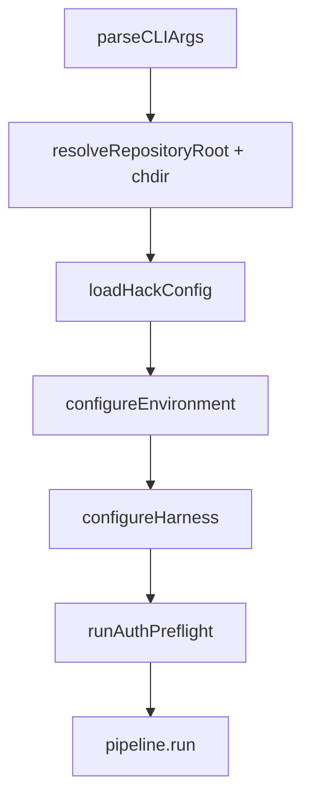

# PRP — P4.M1.T1.S1: README.md + docs/ARCHITECTURE.md + docs/CONFIGURATION.md changeset-level sync

---

## Goal

**Feature Goal**: Complete the **Mode-B changeset-level documentation sweep** for delta
session 009 (PRD §9.7 `.hack` Config File, §9.8 Repository-Root Resolution, §5.3
Breakdown-in-Progress). All implementing subtasks in Phases 1–3 are complete; this task runs
LAST and syncs the three cross-cutting user-facing docs so they coherently describe the three
new features: the **`.hack` TOML config file** (three-tier layering, `hack config` subcommand,
secrets policy, env-over-file rule), **run-from-anywhere** (upward `.git` traversal + `chdir` +
`--repo-root` override), and the **breakdown-in-progress** calm notice (exit 0). This is **Mode
B** (the contract item 6 explicitly says "This IS the documentation task — no per-subtask Mode
A duplication") — purely additive documentation across three existing `.md` files; no source,
no tests, no PRD edits, no new files.

**Deliverable** (3 existing docs modified; **zero** new files, **zero** source/test/config
changes):

1. **`README.md`** (MODIFY) — three edits:
   - **(a)** A new `### The .hack Configuration File` subsection inserted as the **first**
     subsection under the existing `## Configuration` heading (between L324 and L326),
     describing the `.hack` file (three-tier layering global→project→local), the `hack config`
     subcommand, the secrets policy, and the env-over-file rule. Cross-references
     `docs/CLI_REFERENCE.md` and `docs/CONFIGURATION.md`.
   - **(b)** A new `## Running from Anywhere` top-level section (inserted between L106 and
     L108, after Quick Start) explaining that `hack` resolves the repo root automatically via
     upward `.git` traversal, with the `--repo-root` escape hatch.
   - **(c)** A `>` blockquote appended to the existing `### Task Status (hack status / hack
     task)` section (after L279) documenting the breakdown-in-progress calm notice + exit 0.
2. **`docs/ARCHITECTURE.md`** (MODIFY) — one new section + ToC bullet:
   - A new `## Bootstrap Layer` section (inserted between L82 and L84, before
     `## Resolved-Document Invariant`) covering the §8/§9.8/§9.7 bootstrap ordering
     (`parseCLIArgs()` → repo-root resolution + `chdir` → `.hack` load → env/harness/preflight
     → pipeline). Documents the repo-root resolver (`src/utils/repo-root.ts`) and the `.hack`
     layered loader (`src/config/hack-config.ts`). Uses a mermaid `graph TD` diagram + a GFM
     ordering table, matching house style. Adds a ToC bullet at L13-23.
3. **`docs/CONFIGURATION.md`** (MODIFY) — four edits:
   - **(a)** A new `## .hack Configuration File` section (inserted between L53 and L55, before
     `## Environment Variables`) making `.hack` the PRIMARY configuration mechanism, with the
     §9.7.5 schema reference table (summary + link to PRD §9.7.5), the env-over-file rule, the
     secrets policy, and three-tier discovery.
   - **(b)** Rewrite the `## Configuration Priority` 4-layer numbered list (L407-411) → the
     §9.2.1 **7-layer** precedence model.
   - **(c)** A new `## Task & Status Commands` section (after `## CLI Options` L303 or before
     `## See Also` L698) documenting the breakdown-in-progress exit code 0 + the
     `awaiting_breakdown` JSON object.
   - **(d)** Reconcile the `PRP_COMMIT_FORMAT` env-var row (L165) to cross-reference the `.hack`
     `[pipeline] commit_format` key (note it is already live in `constants.ts`/
     `getPrpCommitFormat()`).

**Success Definition**:
- The three docs coherently and consistently describe `.hack`, run-from-anywhere, and
  breakdown-in-progress, cross-referencing each other and citing the governing PRD sections
  (§9.7, §9.8, §5.3, §9.2.1, §5.1).
- **No stale "must run from repo root" framing remains** in any of the three docs (verified by
  a Level-4 grep gate — the scouts found none currently exists, so this is a no-op for prose,
  but the gate proves it).
- `npm run validate` GREEN (the docs pass prettier `format:check` on `.md`; lint/typecheck/test
  unaffected — docs-only).
- `git diff --name-only` shows EXACTLY `README.md`, `docs/ARCHITECTURE.md`,
  `docs/CONFIGURATION.md` (3 files — Mode B, no source/tests/config).

---

## User Persona (if applicable)

**Target User**: A new operator reading the README to get started; a contributor/maintainer
reading ARCHITECTURE.md to understand the bootstrap sequence; an operator writing a `.hack`
file or a CI script polling `hack status`. This task is the single source of truth that makes
the three new features *discoverable* — without it, the features exist in code but are
invisible to users (no `.hack` docs, no "run from anywhere" promise, no breakdown-in-progress
calm-notice documentation).

**Use Case**: (1) An operator wants to commit project defaults → reads README/CONFIGURATION
`.hack` section → runs `hack config init`. (2) An operator in a deep subdirectory runs
`hack status` → it "just works" because of repo-root resolution; the docs explain why. (3) A
CI poll loop hits `hack status` during breakdown → gets exit 0 + calm notice instead of a scary
error; the docs explain the state.

**User Journey**: README Quick Start → (new) Running from Anywhere → Configuration → `.hack`
subsection → (link) CONFIGURATION.md `.hack` section (full schema) → (link) CLI_REFERENCE.md
`hack config`. ARCHITECTURE.md → Bootstrap Layer (how startup works). CONFIGURATION.md →
`.hack` (primary) → 7-layer precedence → Task & Status Commands (exit codes).

**Pain Points Addressed**: The three features shipped in Phases 1–3 but the docs predate them.
Users have no way to discover `.hack`, don't know they can run from anywhere, and would be
alarmed by the breakdown-in-progress state if undocumented. This task closes that gap.

---

## Why

- **PRD compliance**: This task realizes the delta_prd.md "Phase 4 — Sync Changeset-Level
  Documentation (Mode B)" — the cross-cutting docs that "only make sense once the whole delta
  lands" and "depend on every implementing subtask in Phases 1–3." Contract item 4 OUTPUT:
  "Coherent changeset-level docs in README.md, docs/ARCHITECTURE.md, docs/CONFIGURATION.md.
  Completes Phase P4 and the delta."
- **Contract mapping**:
  - **CONTRACT (1) RESEARCH NOTE** — *"README already has sections but NO mention of .hack
    config file, repo-root resolution, or breakdown-in-progress. ARCHITECTURE.md has bootstrap
    info but predates this delta — it may have stale 'must run from repo root' framing.
    CONFIGURATION.md covers env vars and .env but has no .hack file section."* → Scout findings
    refined this: README has NO `.hack`/repo-root/breakdown content (additive);
    ARCHITECTURE.md has NO bootstrap section AND NO stale framing (additive); CONFIGURATION.md
    has NO `.hack` content AND NO stale framing (additive + one 4-layer→7-layer list rewrite).
    The "may have stale framing" warning was a precaution; the scouts confirmed it's a no-op
    for prose (the Level-4 gate still proves it).
  - **CONTRACT (3) LOGIC (a)** — README `.hack` section + Running-from-anywhere + breakdown
    mention → Task 1 (three README edits).
  - **CONTRACT (3) LOGIC (b)** — ARCHITECTURE bootstrap-layer section + repo-root resolver +
    `.hack` loader + stale-framing sweep → Task 2.
  - **CONTRACT (3) LOGIC (c)** — CONFIGURATION `.hack` as PRIMARY + §9.7.5 schema + env-over-file
    + secrets policy + §9.2.1 7-layer cross-ref + §5.1 commit-format reconcile + breakdown
    exit-code → Task 3.
  - **CONTRACT (5) MOCKING** — "N/A (documentation-only task)." → No mocks, no tests.
  - **CONTRACT (6) DOCS** — "[Mode B] This IS the documentation task — no per-subtask Mode A
    duplication." → Per-file Mode A docs rode with Phases 1–3 (e.g. `--repo-root` is in
    CLI_REFERENCE per P1.M1.T1.S2; breakdown-in-progress is in CLI_REFERENCE per P3.M1.T1.S1;
    `hack config` is in CLI_REFERENCE per P2.M2.T2.S1). This task does NOT re-document those
    subcommand details in README/ARCHITECTURE/CONFIGURATION — it **cross-references**
    CLI_REFERENCE and adds the cross-cutting narrative.
- **No overlap with the parallel P3.M1.T1.S1**: that PRP owns `src/cli/index.ts` +
  `tests/unit/cli/index.test.ts` + the `### Task Management` subsection of
  `docs/CLI_REFERENCE.md`. This PRP owns README + ARCHITECTURE + CONFIGURATION (disjoint files,
  disjoint doc sections). Both document breakdown-in-progress but in DIFFERENT docs (S1 =
  CLI_REFERENCE task section; this = README task-status blockquote + CONFIGURATION exit-code
  section) — no duplication, complementary surfaces.
- **Closes Phase P4 and the delta**: item 4 OUTPUT — "Completes Phase P4 and the delta."

---

## What

Three existing `.md` files modified. **Zero** new files, **zero** source/test/config/PRD
changes. **Purely additive** (the scouts confirmed no stale framing exists to rewrite, except
the CONFIGURATION.md 4-layer→7-layer precedence list which is incomplete-but-not-wrong).

### Success Criteria

- [ ] **`README.md`** (MODIFY):
      - New `### The .hack Configuration File` subsection (FIRST subsection under `## Configuration`,
        between L324 and L326): one-sentence purpose + a 3-row tier table (Global `~/.hack` /
        Project `<repoRoot>/.hack` committable / Project-local `<repoRoot>/.hack.local`
        gitignored) + a fenced `bash` example (`hack config init`, `hack config show`) + a `>`
        blockquote on the secrets policy + env-over-file rule. Cites `(PRD §9.7)`. Links to
        `docs/CLI_REFERENCE.md` (the `hack config` reference) and the new
        `docs/CONFIGURATION.md#hack-configuration-file` anchor.
      - New `## Running from Anywhere` top-level section (between L106 and L108): 2–3 sentences
        + a fenced `bash` snippet (`cd src/deep && hack status` resolves to repo root) + a `>`
        note for `--repo-root`. Cites `(PRD §9.8)`.
      - `>` blockquote appended to `### Task Status (hack status / hack task)` (after L279):
        documents the breakdown-in-progress calm notice + exit 0 + `--output json`
        `awaiting_breakdown` object. Cites `(PRD §5.3)`.
- [ ] **`docs/ARCHITECTURE.md`** (MODIFY):
      - New `## Bootstrap Layer` section (between L82 and L84, before
        `## Resolved-Document Invariant`): bold purpose statement + `**Location**: src/index.ts
        (main())` + a mermaid `graph TD` diagram of the bootstrap ordering
        (`parseCLIArgs → resolveRepositoryRoot+chdir → loadHackConfig → configureEnvironment →
        configureHarness → runAuthPreflight → pipeline.run`) + a GFM ordering table (Step |
        Action | Source | PRD §) + `>` callouts for the repo-root resolver
        (`src/utils/repo-root.ts`: dir-or-file `.git`, nearest-ancestor, `NotARepositoryError`)
        and the `.hack` loader (`src/config/hack-config.ts`: 3-tier, env-over-file seeding).
        Cross-references the harness-config prose at L391-415 and defers the full `.hack` schema
        to CONFIGURATION.md (house pattern L627). Cites `(PRD §8)`, `(PRD §9.8)`, `(PRD §9.7)`.
      - ToC bullet added at L13-23: `- [Bootstrap Layer](#bootstrap-layer)`.
      - Flag (optional, low-risk): the `configureHarnesses()` (plural) at L391-415 vs source
        `configureHarness()` (singular) name drift — add a one-line note or leave (out of strict
        scope but mentioned by scout2).
- [ ] **`docs/CONFIGURATION.md`** (MODIFY):
      - New `## .hack Configuration File` section (between L53 and L55, before `## Environment
        Variables`): intro that `.hack` is the PRIMARY config mechanism + a per-section schema
        table (mirror the env-var table style; authoritative rows from `SCHEMA_MAP` in
        `src/config/hack-config.ts` L155-380 — summary table + link to PRD §9.7.5) + the
        env-over-file rule + the secrets policy (3-tier table: tier/file/committable/secrets) +
        `hack config` subcommand summary. Cites `(PRD §9.7)`.
      - Rewrite `## Configuration Priority` (L407-411): replace the 4-layer numbered list with
        the §9.2.1 **7-layer** precedence (CLI flags > shell env > `.env` > `.hack.local` >
        `.hack` > global `.hack` > defaults) + the env-over-file rule (`>` callout: `.hack`
        seeds `process.env` ONLY when `undefined`; real env — even empty — wins over file).
        Cites `(PRD §9.2.1)`.
      - New `## Task & Status Commands` section (after `## CLI Options` L303 or before
        `## See Also` L698): documents `hack status`/`hack task`/`hack task next` exit codes —
        the breakdown-in-progress state (exit 0, calm notice, `awaiting_breakdown` JSON), the
        `--file` hard error, the no-sessions hard error. Cites `(PRD §5.3)`.
      - Edit the `PRP_COMMIT_FORMAT` row (L165): add a cross-reference to the `.hack
        [pipeline] commit_format` key (note it is already live in `constants.ts` /
        `getPrpCommitFormat()`).
      - ToC (L9-37): add entries for the new `## .hack Configuration File` and
        `## Task & Status Commands` sections.
- [ ] **Cross-doc consistency**: README `.hack` section links to both CLI_REFERENCE and the new
      CONFIGURATION anchor; ARCHITECTURE bootstrap section defers the `.hack` schema to
      CONFIGURATION (no duplication); CONFIGURATION cites PRD §9.7 as authoritative schema.
- [ ] `npm run validate` GREEN (docs pass `format:check`; lint/typecheck/test unaffected).
- [ ] `git diff --name-only` shows EXACTLY `README.md`, `docs/ARCHITECTURE.md`,
      `docs/CONFIGURATION.md`.

---

## All Needed Context

### Context Completeness Check

✅ "If someone knew nothing about this codebase, would they have everything needed to implement
this successfully?" — YES. This PRP names: the exact insertion points (README L106/108, L279,
L324/326; ARCHITECTURE L82/84 + ToC L13-23; CONFIGURATION L53/55, L165, L303/698, L407-411 +
ToC L9-37); the exact house styles to mirror (README fenced-bash + pipe tables + `>` callouts;
ARCHITECTURE mermaid + `**Location**` + GFM tables + `(PRD §X.Y)` sub-section precision;
CONFIGURATION pipe tables + numbered precedence lists); the exact implementation ground truth
to document (bootstrap ordering with src/index.ts line anchors; `resolveRepositoryRoot`
signature + dir-or-file `.git` + nearest-ancestor + `NotARepositoryError`; `loadHackConfig`
3-tier + env-over-file seeding + secrets policy; `SCHEMA_MAP` as the schema-table data source;
`PRP_COMMIT_FORMAT` already live; breakdown-in-progress exit 0); and the exact cross-doc links
to establish. The scouts verified every fact against live source.

### Documentation & References

```yaml
# MUST READ — the authoritative feature specs (PRD sections governing this delta)
- docfile: PRD.md
  section: "§9.7 The .hack Configuration File" (h3.24) — esp. §9.7.3 (discovery/layering),
       §9.7.5 (schema reference), §9.7.6 (secrets policy), §9.7.8 (hack config subcommand),
       §9.7.9 (interaction with existing subsystems).
  why: The authoritative spec for the .hack file. The CONFIGURATION.md schema table is a
       SUMMARY + link to §9.7.5 (do not duplicate the full §9.7.5 table verbatim).
  critical: three-tier layering (global ~/.hack → project .hack → project-local .hack.local);
       env-over-file rule (real env wins over file); secrets refused in committable tiers.

- docfile: PRD.md
  section: "§9.8 Repository Root Resolution" (h3.25) — esp. §9.8.2 (algorithm), §9.8.3 (chdir),
       §9.8.4 (.git dir-or-file), §9.8.5 (NotARepositoryError), §9.8.6 (--repo-root override).
  why: The authoritative spec for run-from-anywhere. The README + ARCHITECTURE sections cite it.
  critical: nearest-ancestor .git wins; .git as dir OR file (worktree/submodule); hard error
       when no .git ancestor; --repo-root skips the walk.

- docfile: PRD.md
  section: "§5.3 Tasks-Not-Yet-Generated Window (Breakdown-in-Progress)" (h3.11) + the 5
       acceptance criteria.
  why: The authoritative spec for the breakdown-in-progress calm notice. README blockquote +
       CONFIGURATION exit-code section cite it.
  critical: exit code 0 (observation, not failure); --file override + no-sessions remain HARD
       errors (distinct empty states).

- docfile: PRD.md
  section: "§9.2.1 Configuration Source Priority" (h4.0) — the 7-layer precedence model.
  why: The authoritative precedence order for the CONFIGURATION.md 4-layer→7-layer rewrite.
  critical: CLI > shell-env > .env > .hack.local > .hack > global-.hack > defaults; env-over-file.

- docfile: PRD.md
  section: "§5.1 State & File Management" (commit-format text) + "§9.2.2 PRP_COMMIT_FORMAT".
  why: The CONFIGURATION.md reconcile — PRP_COMMIT_FORMAT is ALREADY live (constants.ts +
       getPrpCommitFormat), accessible via .hack [pipeline] commit_format. Note this, don't
       re-document.

# MUST READ — this subtask's research (verified against live source)
- docfile: plan/009_94353b1a9fd3/P4M1T1S1/research/00_research_summary.md
  why: §VERDICT (purely additive; stale-framing sweep is a no-op), §SCOPE (the 6-edit table with
       exact insertion points), §Implementation ground truth (bootstrap ordering with line
       anchors, resolveRepositoryRoot/loadHackConfig/SCHEMA_MAP signatures, PRP_COMMIT_FORMAT),
       §The 7-layer §9.2.1 precedence, §House styles, §CRITICAL cross-doc consistency.
- docfile: plan/009_94353b1a9fd3/P4M1T1S1/research/scout1-readme-docs.md
  why: README.md full heading outline (L1-831), the ## Configuration collision (L324-545) → use
       a ### subsection, term-coverage table (.hack/hack config/--repo-root all ABSENT),
       verbatim house-style examples (fenced bash L263-280, blockquote L319-322, pipe table
       L326-339), stale-framing sweep (0 matches), docs/ link inventory.
- docfile: plan/009_94353b1a9fd3/P4M1T1S1/research/scout2-architecture-doc.md
  why: ARCHITECTURE.md full heading outline, the insertion seam (L82/84), the absence of any
       bootstrap section (purely additive), mermaid/GFM/**Location** house style, the accurate
       (non-stale) process.cwd() at L838, the authoritative bootstrap ordering (§7, verified
       against src/index.ts main() line-by-line), PRD cross-ref style.
- docfile: plan/009_94353b1a9fd3/P4M1T1S1/research/scout3-config-source.md
  why: CONFIGURATION.md full heading outline (706 lines), insertion point L53/55, the env-var +
       CLI table styles to mirror, the 4-layer list at L407-411 to rewrite, PRP_COMMIT_FORMAT
       already at L165, NO task/status section exists (must create), AND the full implementation
       signatures (repo-root.ts, hack-config.ts, constants.ts, index.ts bootstrap, config.ts
       subcommand, package.json smol-toml) so the docs match reality.

# THE FILES TO EDIT (the three docs)
- file: README.md
  sections: L106-108 (insert ## Running from Anywhere), L263-280 (extend ### Task Status with
       breakdown blockquote after L279), L324-326 (insert ### The .hack Configuration File as
       FIRST subsection under ## Configuration).
  why: The three README edits (contract 3a).
  pattern: fenced-bash blocks (comment+command pairs, L263-280), pipe tables (L326-339), >
       blockquote callouts (L319-322, L341-345), inline (PRD §X.Y), docs/<FILE>.md#anchor links.
  gotcha: ## Configuration ALREADY exists (L324-545) → add a ### subsection, NOT a second
       top-level (preserves the #configuration anchors at L81/L106). Bare `hack …` for
       subcommands; `npm run dev -- …` for pipeline examples.

- file: docs/ARCHITECTURE.md
  sections: L13-23 (ToC — add Bootstrap Layer bullet), L82-84 (insert ## Bootstrap Layer before
       ## Resolved-Document Invariant).
  why: The ARCHITECTURE edit (contract 3b). NO bootstrap section exists → purely additive.
  pattern: mermaid graph TD (Validation Gates L547-571 style), GFM ordering table (Model Roles
       L601-609 style), **Location**: src/... line (Pipeline Controller L281 style), > callouts
       (L625 style), (PRD §9.8.2) sub-section precision, --- dividers (L83 style).
  gotcha: defer the full .hack schema to CONFIGURATION.md (house pattern L627: "ARCHITECTURE.md
       does not duplicate that table"). Cross-ref the harness-config prose at L391-415. The
       configureHarnesses() (plural) at L391 vs source configureHarness() (singular) drift —
       flag or leave (low-risk).

- file: docs/CONFIGURATION.md
  sections: L9-37 (ToC), L53-55 (insert ## .hack Configuration File before ## Environment
       Variables), L165 (edit PRP_COMMIT_FORMAT row → cross-ref .hack [pipeline] commit_format),
       L303 or L698 (insert ## Task & Status Commands), L405-411 (rewrite ## Configuration
       Priority 4-layer → 7-layer).
  why: The four CONFIGURATION edits (contract 3c). .hack is entirely absent → purely additive.
  pattern: env-var pipe table (L43-53, cols Variable|Required|Default|Description), CLI pipe
       table (L238-241), numbered precedence list with bold lead-ins (L407-411).
  gotcha: mirror the per-section table style (one ### [section] table each) for the .hack schema
       rather than one giant table (~40 rows/13 sections in SCHEMA_MAP). The §9.7.5 table is the
       authoritative reference — CONFIGURATION gives a SUMMARY + link. Update the ToC (L9-37)
       for both new sections or anchors break.

# IMPLEMENTATION GROUND TRUTH (read-only source — so the docs are accurate)
- file: src/index.ts
  section: main() L121-L297 — the bootstrap ordering.
  why: The ARCHITECTURE bootstrap section documents THIS ordering. Verified by scout2/scout3:
       INVOCATION_CWD = process.cwd() (L64); resolveRepositoryRoot(INVOCATION_CWD, {explicit?})
       (L142); process.chdir(repoRoot) (L146); PRD-exists check (L148-155);
       loadHackConfig(repoRoot) (L165); configureEnvironment() (L168); getLogger (L174);
       --dry-run/--validate-prd early returns; configureHarness() (L242); runAuthPreflight()
       (L251); ensureHarnessInitialized() (L256); new PRPPipeline + pipeline.run() (L281, L297).

- file: src/utils/repo-root.ts
  why: The ARCHITECTURE bootstrap section documents the resolver. Verified: signature (L152-156)
       resolveRepositoryRoot(startDir, opts?: {explicit?}) → {repoRoot, invocationCwd};
       NotARepositoryError (L52-90) with .searchedFrom/.explicit + --repo-root remediation;
       traverseUp (L191-205) existsSync(join(dir,'.git')) — true for dir AND file;
       nearest-ancestor wins; realpathSync canonicalizes; getRepoRoot() (L171)/getInvocationCwd()
       (L184) singletons.

- file: src/config/hack-config.ts
  why: The README + CONFIGURATION sections document the loader. Verified: parseHackFile (L80,
       BOM rejection); loadHackConfig (L799, 3-tier); globalHackPath (L506, XDG cascade);
       seedProcessEnv (L549-561, === undefined env-over-file); isSecretKey (L666, _key/_token/
       _secret/_password suffix); validateHackTier (L753, hard error for secrets in committable
       tiers + type/range/enum, warn for unknowns); SCHEMA_MAP (L155-380, the §9.7.5 data
       source). hack config subcommand in src/cli/commands/config.ts + src/cli/index.ts L567-571.

- file: src/config/constants.ts
  why: The CONFIGURATION reconcile. Verified: PRP_COMMIT_FORMAT (L439);
       DEFAULT_PRP_COMMIT_FORMAT='task-prefix' (L449); PrpCommitFormat type (L459);
       getPrpCommitFormat() (L482, single read site). .hack mapping [pipeline] commit_format
       (SCHEMA_MAP L245-252).

- file: src/cli/commands/config.ts + src/cli/index.ts L567-571
  why: The hack config subcommand (init/show/validate/path) — README + CONFIGURATION summarize
       it and link to CLI_REFERENCE (which already fully documents it at L205-276).

# CROSS-REFERENCES (already-documented sibling surfaces — link, don't duplicate)
- file: docs/CLI_REFERENCE.md
  section: L205-276 (hack config), the ### Task Management subsection (breakdown-in-progress,
       per the parallel P3.M1.T1.S1), --repo-root flag (per P1.M1.T1.S2).
  why: The README/CONFIGURATION .hack + breakdown + run-from-anywhere sections CROSS-REFERENCE
       CLI_REFERENCE (the exhaustive subcommand/flag reference), they do NOT duplicate it.
```

### Current Codebase tree (relevant slice)

```bash
README.md                       # EDIT — +### .hack subsection, +## Running from Anywhere, +breakdown blockquote
docs/
  ARCHITECTURE.md               # EDIT — +## Bootstrap Layer section, +ToC bullet
  CONFIGURATION.md              # EDIT — +## .hack Configuration File, rewrite ## Configuration Priority (4→7 layers),
                                #        +## Task & Status Commands, edit PRP_COMMIT_FORMAT row, +ToC entries
  CLI_REFERENCE.md              # READ-ONLY — already documents hack config (L205-276), --repo-root, breakdown
                                #   (per Phases 1-3 Mode-A docs). Cross-reference target, NOT edited here.
PRD.md                          # READ-ONLY — §9.7, §9.8, §5.3, §9.2.1, §5.1 (the authoritative specs)
src/                            # READ-ONLY — index.ts (bootstrap), repo-root.ts, hack-config.ts, constants.ts
plan/009_94353b1a9fd3/          # READ-ONLY — research/, delta_prd.md, architecture/system_context.md
package.json                    # READ-ONLY — smol-toml dep (L82); npm scripts (validate, format:check)
.prettierrc / .markdownlint.json # READ-ONLY — doc formatting/lint rules
```

### Desired Codebase tree with files to be added and responsibility of file

```bash
README.md                       # MODIFIED — .hack Configuration subsection + Running from Anywhere + breakdown note
docs/ARCHITECTURE.md            # MODIFIED — ## Bootstrap Layer section + ToC bullet
docs/CONFIGURATION.md           # MODIFIED — ## .hack Configuration File + 7-layer precedence rewrite +
                                #           ## Task & Status Commands + PRP_COMMIT_FORMAT cross-ref + ToC entries
# (NO new files — Mode B documentation sync across 3 existing docs)
```

### Known Gotchas of our codebase & Library Quirks

```markdown
<!-- CRITICAL (## Configuration collision in README): README.md ALREADY has a `## Configuration`
     heading (L324-545, env-var focused). Do NOT create a second top-level `## Configuration` —
     it would collide and break the internal `#configuration` anchors at L81 and L106. Add a
     `### The .hack Configuration File` subsection as the FIRST subsection under the existing
     `## Configuration` (between L324 and L326). -->

<!-- CRITICAL (cross-doc consistency, no duplication): The .hack system, hack config subcommand,
     --repo-root flag, and breakdown-in-progress notice are ALREADY documented in
     docs/CLI_REFERENCE.md (per Phases 1-3 Mode-A docs). README/ARCHITECTURE/CONFIGURATION
     CROSS-REFERENCE CLI_REFERENCE — they do NOT re-document the subcommand syntax/flags. The
     ARCHITECTURE bootstrap section DEFERS the full .hack schema to CONFIGURATION.md (house
     pattern L627: "ARCHITECTURE.md does not duplicate that table"). -->

<!-- CRITICAL (PRD §9.7.5 is the authoritative schema): The CONFIGURATION.md .hack schema table
     is a SUMMARY + link to PRD §9.7.5 — do NOT duplicate the full ~40-row table verbatim.
     Mirror the per-section table style (one ### [section] table each) for readability. The
     authoritative row data is SCHEMA_MAP in src/config/hack-config.ts L155-380. -->

<!-- CRITICAL (ToCs must be updated): docs/ARCHITECTURE.md (ToC L13-23) and docs/CONFIGURATION.md
     (ToC L9-37) have manual Tables of Contents. Every new ## section (Bootstrap Layer, .hack
     Configuration File, Task & Status Commands) MUST get a ToC bullet/entry or the doc's
     internal anchors break. README has no formal ToC (skip). -->

<!-- CRITICAL (stale-framing sweep is a no-op but must be PROVEN): The scouts found ZERO stale
     "must run from repo root" framing in any of the three docs. The CONFIGURATION.md 4-layer
     list (L407-411) is incomplete (omits .hack tiers) but not "wrong." The sweep is a no-op for
     PROSE, but the Level-4 grep gate (`must run from|run from the root|cwd|from the project root`)
     MUST still be run across all three docs to PROVE nothing was missed and nothing stale was
     introduced by the new sections. -->

<!-- GOTCHA (prettier checks .md): `npm run format:check` runs prettier on
     `**/*.{ts,js,json,md,yml,yaml}`. The .md edits must be prettier-clean (wrap tables
     consistently, no trailing whitespace, fenced blocks with language). Check `.prettierignore`
     for any doc exclusions. Run `npm run format` if format:check complains. -->

<!-- GOTCHA (markdownlint may apply): `.markdownlint.json` exists at repo root. Check whether
     docs/ is linted (`.markdownlintignore`). Common rules: no duplicate headings, consistent
     heading capitalization, fenced blocks need a language. The new ## sections must not
     violate heading-uniqueness (e.g. don't add a second "Configuration" H2). -->

<!-- GOTCHA (mermaid syntax): ARCHITECTURE.md uses mermaid diagrams (flowchart/stateDiagram/graph).
     The new bootstrap diagram must use valid mermaid `graph TD` syntax (quoted node labels,
     semicolon or newline-terminated statements) matching the Validation Gates style (L547-571).
     Verify mermaid renders (some linters validate mermaid blocks). -->

<!-- GOTCHA (PRD citation precision): house style uses sub-section precision — `(PRD §9.8.2)`
     for the traversal algorithm, `(PRD §9.7.3)` for tier discovery, `(PRD §9.7.9)` for the
     bootstrap-position interaction, NOT just `(PRD §9.8)`. Match the existing precision
     (ARCHITECTURE.md L601 `(PRD §9.2.3 / §6.1)`, L1038 `### Guard Rails (PRD §4.6)`). -->

<!-- GOTCHA (npm run dev vs bare hack): README house style uses `npm run dev -- --prd ./PRD.md`
     for pipeline examples and bare `hack …` ONLY for subcommands (status/task). New .hack and
     run-from-anywhere examples should use bare `hack config …` / `hack status …` to match the
     subcommand precedent. -->

<!-- GOTCHA (no source/test/PRD changes): This is Mode B — documentation ONLY. Do NOT touch
     src/, tests/, PRD.md, package.json, tasks.json, prd_snapshot.md, or any config. The diff is
     EXACTLY README.md + docs/ARCHITECTURE.md + docs/CONFIGURATION.md. -->
```

---

## Implementation Blueprint

### Data models and structure

No data models — this is a documentation task. The "structure" is the markdown heading
hierarchy of the three docs. The new sections follow the existing house style of each doc
(scouts captured verbatim examples).

### Implementation Tasks (ordered by dependencies)

```yaml
Task 1: MODIFY README.md — three edits (contract 3a)
  - EDIT 1 (## Running from Anywhere): insert a new top-level section between L106 (end of
    Quick Start **Next Steps**) and L108 (## Distributed (Multi-File) PRDs). Content: 2-3
    sentences explaining hack resolves the repo root automatically via upward .git traversal
    (cite PRD §9.8), a fenced bash snippet (`cd src/deep && hack status` resolves to repo
    root), and a > blockquote for --repo-root (PRD §9.8.6) + the hard-error when no .git
    ancestor (PRD §9.8.5).
  - EDIT 2 (breakdown-in-progress blockquote): append a > blockquote to the existing
    ### Task Status (hack status / hack task) section, AFTER the fenced bash block (L279) and
    BEFORE ### Resume Interrupted Session (L281). Content: the breakdown-in-progress calm
    notice (exit 0), the --output json awaiting_breakdown object, and the note that --file +
    no-sessions remain hard errors. Cite (PRD §5.3). Mirror the L319-322 blockquote style.
  - EDIT 3 (### The .hack Configuration File): insert as the FIRST subsection under the
    existing ## Configuration (between L324 ## Configuration and L326 ### Environment
    Variables). Content: one-sentence purpose (.hack is the committable TOML config file,
    PRD §9.7); a 3-row tier table (Global ~/.hack / Project <repoRoot>/.hack committable /
    Project-local <repoRoot>/.hack.local gitignored); a fenced bash example (hack config init,
    hack config show); a > blockquote on the secrets policy (committable .hack refuses secrets;
    .hack.local is the gitignored secrets tier) + env-over-file rule (real env wins over file).
    Link to docs/CLI_REFERENCE.md (hack config, L205-276) and the new
    docs/CONFIGURATION.md#hack-configuration-file anchor.
  - FOLLOW pattern: fenced-bash (L263-280), pipe tables (L326-339), > blockquotes (L319-322,
    L341-345), inline (PRD §X.Y), docs/<FILE>.md#anchor links (L343, L349).
  - GOTCHA: ## Configuration ALREADY exists (L324-545) → use a ### subsection. Preserve the
    #configuration anchors (L81, L106). Bare `hack …` for subcommands.

Task 2: MODIFY docs/ARCHITECTURE.md — new ## Bootstrap Layer section + ToC bullet (contract 3b)
  - EDIT 1 (ToC): add `- [Bootstrap Layer](#bootstrap-layer)` to the Table of Contents (L13-23),
    after the System Overview bullet.
  - EDIT 2 (## Bootstrap Layer): insert a new top-level section between L82 (end of ### System
    Flow Description) and L84 (## Resolved-Document Invariant), preceded by a --- divider
    (house pattern L83). Content:
    * Bold purpose statement: "The **bootstrap layer** runs before any of the four processing
      engines (PRD §3, §8)..."
    * `**Location**: [`src/index.ts`](../src/index.ts) (`main()`).`
    * A mermaid `graph TD` diagram of the ordering:
        parseCLIArgs --> resolveRepositoryRoot+chdir --> loadHackConfig --> configureEnvironment
        --> configureHarness --> runAuthPreflight --> pipeline.run
      (match the Validation Gates graph style L547-571).
    * A GFM ordering table (Step | Action | Source | PRD §) with the 8-10 steps from
      src/index.ts main() (verified line anchors in research/00 §Implementation ground truth).
    * A > callout for the repo-root resolver ([src/utils/repo-root.ts]): dir-or-file .git
      detection (§9.8.4), nearest-ancestor wins (§9.8.2), NotARepositoryError hard error (§9.8.5),
      --repo-root override (§9.8.6), realpathSync canonicalization.
    * A > callout for the .hack loader ([src/config/hack-config.ts]): 3-tier discovery
      (global ~/.hack/XDG → project .hack → project-local .hack.local, §9.7.3), env-over-file
      seeding (real env wins, §9.2.1), secrets policy (committable tiers refuse secrets, §9.7.6),
      loads AFTER chdir + BEFORE configureEnvironment (§9.7.9).
    * Cross-reference: "For the full .hack schema, see [Configuration → .hack](./CONFIGURATION.md#hack-configuration-file).
      For harness configuration, see [Agent Creation](#agent-creation) below." (house deferral
      pattern L627).
  - FOLLOW pattern: mermaid graph TD (L547-571), GFM table (L601-609), **Location** line
    (L281), > callouts (L625), (PRD §9.8.2) sub-section precision, --- dividers (L83).
  - GOTCHA: NO bootstrap section exists → purely additive (don't rewrite; add). Defer the full
    .hack schema to CONFIGURATION.md. Optionally flag the configureHarnesses() (plural, L391)
    vs source configureHarness() (singular) drift (low-risk, scout2 noted it).

Task 3: MODIFY docs/CONFIGURATION.md — four edits (contract 3c)
  - EDIT 1 (## .hack Configuration File): insert a new top-level section between L53 (end of
    ## Quick Reference) and L55 (## Environment Variables). Content:
    * Intro: ".hack is the PRIMARY configuration mechanism — a committable TOML file capturing
      every tunable default (PRD §9.7)."
    * A per-section schema SUMMARY table (mirror the env-var table style L43-53; authoritative
      rows from SCHEMA_MAP L155-380 — group by [section]: [models], [endpoint], [harness],
      [pipeline], [commit], [bug_hunt], [validation], [distributed_prd], [tasks_lock],
      [concurrency], [api], [monitor], [cli]). Add a link to PRD §9.7.5 for the authoritative
      full reference.
    * The env-over-file rule (> callout: .hack seeds process.env ONLY when undefined; real env
      — even empty — wins over file; PRD §9.2.1).
    * The secrets policy (3-tier table: tier/file/committable/secrets; committable .hack refuses
      secrets → hard error; .hack.local is the only secrets-allowed tier; PRD §9.7.6).
    * hack config subcommand summary (init/show/validate/path) + link to CLI_REFERENCE.
  - EDIT 2 (## Configuration Priority rewrite): replace the 4-layer numbered list (L407-411)
    with the 7-layer §9.2.1 precedence:
      1. CLI flags
      2. Shell environment (real exported env vars — even empty — win over file)
      3. .env file
      4. .hack.local (gitignored; secrets allowed)
      5. .hack (committable; no secrets)
      6. Global .hack (~/.hack | XDG | $HACK_CONFIG_HOME)
      7. Default values (constants.ts)
    Add a > callout for the env-over-file rule (.hack tiers seed process.env ONLY when
    undefined). Cite (PRD §9.2.1).
  - EDIT 3 (## Task & Status Commands): insert a new section (after ## CLI Options L303, or
    before ## See Also L698). Content: documents hack status/hack task/hack task next exit
    codes — the breakdown-in-progress state (exit 0, calm notice, awaiting_breakdown JSON
    object), the --file hard error (explicit override not softened), the no-sessions hard
    error (distinct empty state). Cite (PRD §5.3).
  - EDIT 4 (PRP_COMMIT_FORMAT row): edit the env-var table row at L165 to add a cross-reference
    to the .hack [pipeline] commit_format key. Note PRP_COMMIT_FORMAT is already live
    (constants.ts PRP_COMMIT_FORMAT + getPrpCommitFormat(), single read site).
  - EDIT 5 (ToC): add entries for ## .hack Configuration File and ## Task & Status Commands to
    the Table of Contents (L9-37).
  - FOLLOW pattern: env-var pipe table (L43-53), CLI pipe table (L238-241), numbered precedence
    list with bold lead-ins (L407-411).
  - GOTCHA: mirror per-section table style (not one giant table — SCHEMA_MAP has ~40 rows).
    §9.7.5 is authoritative — CONFIGURATION gives a SUMMARY + link. Update ToC (L9-37) for both
    new sections. PRP_COMMIT_FORMAT is ALREADY documented at L165 (reconcile/cross-ref, don't
    re-document).

Task 4: VERIFY — cross-doc consistency + stale-framing gate + formatting
  - RUN npm run format:check (prettier on .md) → fix with npm run format if needed.
  - RUN npm run validate → GREEN (lint/typecheck/test unaffected by docs-only; format:check is
    the relevant gate).
  - RUN the Level-4 stale-framing greps across all three docs (research/00 §Validation):
      grep -nE "must run from|run from the root|run from the repo root|from the project root" \
        README.md docs/ARCHITECTURE.md docs/CONFIGURATION.md
    EXPECT: 0 matches (proves no stale framing remains + none introduced).
  - VERIFY cross-doc links resolve:
      grep -nE "hack-configuration-file|bootstrap-layer|CLI_REFERENCE" README.md docs/ARCHITECTURE.md docs/CONFIGURATION.md
  - VERIFY git diff --name-only → EXACTLY README.md, docs/ARCHITECTURE.md, docs/CONFIGURATION.md.
```

### Implementation Patterns & Key Details

```markdown
<!-- PATTERN: README fenced-bash + pipe table + blockquote (mirror L263-345). -->
### The .hack Configuration File

`.hack` is a committable TOML config file that captures every tunable default (PRD §9.7). It
is the recommended way to version-control project settings.

| Tier | File | Committable? | Secrets? |
| ---- | ---- | ------------ | -------- |
| Global | `~/.hack` (or `$XDG_CONFIG_HOME/hack/config`) | n/a (user) | Refused |
| Project | `<repoRoot>/.hack` | Yes | Refused (hard error) |
| Project-local | `<repoRoot>/.hack.local` | No (gitignored) | Allowed |

```bash
# Generate a commented .hack template (also adds .hack.local to .gitignore)
hack config init
# Print the effective merged config (secrets masked)
hack config show --src
```

> **Secrets policy (PRD §9.7.6):** committable `.hack` refuses secret-bearing keys (any key
> ending `_key`/`_token`/`_secret`/`_password`) — move them to `.hack.local` (gitignored) or an
> env var. **Env-over-file rule (PRD §9.2.1):** real env vars override `.hack` values. See
> [CLI Reference](docs/CLI_REFERENCE.md) and [Configuration → .hack](docs/CONFIGURATION.md#hack-configuration-file).

<!-- PATTERN: ARCHITECTURE mermaid graph TD + GFM table + Location + callout (mirror L547-571, L601-609). -->
## Bootstrap Layer

The **bootstrap layer** runs before any of the four processing engines (PRD §3, §8): it
resolves the repository root, loads layered configuration, then configures the environment.

**Location:** [`src/index.ts`](../src/index.ts) (`main()`).



| Step | Action | Source | PRD § |
| ---- | ------ | ------ | ----- |
| 1 | `parseCLIArgs()` | `src/cli/index.ts` | §4.1 |
| 2 | `resolveRepositoryRoot()` + `process.chdir(repoRoot)` | `src/utils/repo-root.ts` | §9.8 |
| 3 | `loadHackConfig(repoRoot)` | `src/config/hack-config.ts` | §9.7 |
| ... | ... | ... | ... |

> **Repo-root resolver** (`src/utils/repo-root.ts`, PRD §9.8): walks upward from
> `INVOCATION_CWD` to the nearest `.git` (dir OR file — worktree/submodule aware, §9.8.4),
> `chdir`s there. No `.git` ancestor → `NotARepositoryError` hard error (§9.8.5). `--repo-root
> <path>` skips the walk (§9.8.6).
>
> **`.hack` loader** (`src/config/hack-config.ts`, PRD §9.7): 3-tier discovery (global →
> project → project-local, §9.7.3), env-over-file seeding (§9.2.1), secrets policy (§9.7.6).
> Loads AFTER the chdir + BEFORE `configureEnvironment()` (§9.7.9). For the full schema, see
> [Configuration → .hack](./CONFIGURATION.md#hack-configuration-file).

<!-- PATTERN: CONFIGURATION 7-layer precedence list (mirror L407-411, expand 4→7). -->
## Configuration Priority

Configuration is loaded from multiple sources in the following priority order (highest to lowest):

1. **CLI flags** - Command-line arguments (`--prd`, `--scope`, etc.)
2. **Shell environment** - Real exported env vars (even empty ones win over `.hack` files)
3. **`.env` file** - Loaded into the environment by the shell/harness
4. **`.hack.local`** - `<repoRoot>/.hack.local` (gitignored; the only `.hack` tier that may hold secrets)
5. **`.hack`** - `<repoRoot>/.hack` (committable; refuses secrets)
6. **Global `.hack`** - `~/.hack` | `$XDG_CONFIG_HOME/hack/config` | `$HACK_CONFIG_HOME/config`
7. **Default values** - Hardcoded in `src/config/constants.ts`

> **Env-over-file rule (PRD §9.2.1):** `.hack` tiers seed `process.env` ONLY when the key is
> `undefined`. A real env var (shell or `.env`) — even an empty one — wins over the file value.

<!-- CRITICAL: cross-reference, don't duplicate. CLI_REFERENCE owns the subcommand syntax;
     CONFIGURATION owns the schema; ARCHITECTURE owns the bootstrap flow. -->
<!-- CRITICAL: update ToCs (ARCHITECTURE L13-23, CONFIGURATION L9-37) for every new ## section. -->
<!-- CRITICAL: run the stale-framing grep gate (Level 4) — it's a no-op but must be PROVEN. -->
```

### Integration Points

```yaml
DOCUMENTATION (3 files, Mode B):
  README.md:
    - add: ### The .hack Configuration File (first subsection under ## Configuration, L324-326).
    - add: ## Running from Anywhere (between L106 and L108).
    - add: > breakdown-in-progress blockquote (after L279, in ### Task Status).
  docs/ARCHITECTURE.md:
    - add: ## Bootstrap Layer (between L82 and L84) + ToC bullet (L13-23).
  docs/CONFIGURATION.md:
    - add: ## .hack Configuration File (between L53 and L55) + ToC entry (L9-37).
    - rewrite: ## Configuration Priority (L407-411) 4-layer → 7-layer §9.2.1.
    - add: ## Task & Status Commands (after L303 or before L698) + ToC entry.
    - edit: PRP_COMMIT_FORMAT row (L165) → cross-ref .hack [pipeline] commit_format.

NO SOURCE / NO TESTS / NO PRD.md / NO package.json / NO tasks.json / NO config / NO CLI
  — Mode B documentation sync across 3 existing .md files only.

CROSS-REFERENCES (establish, don't duplicate):
  - README .hack section → docs/CLI_REFERENCE.md (hack config) + docs/CONFIGURATION.md#hack-configuration-file.
  - ARCHITECTURE bootstrap → defer .hack schema to CONFIGURATION.md (house pattern L627).
  - CONFIGURATION .hack → cite PRD §9.7.5 as authoritative schema reference.
  - All three → cite the governing PRD sections (§9.7, §9.8, §5.3, §9.2.1, §5.1).
```

---

## Validation Loop

### Level 1: Syntax & Style (Immediate Feedback)

```bash
# Docs must pass prettier (format:check runs on **/*.{...,md,...}).
npm run format:check    # prettier --check; run `npm run format` if it complains
# If markdownlint is wired (check .markdownlintignore + package.json scripts):
npx markdownlint README.md docs/ARCHITECTURE.md docs/CONFIGURATION.md 2>/dev/null || true

# Expected: Zero errors. Common prettier/mdlint fixes: table padding, fenced-block language,
# trailing whitespace, heading uniqueness (don't add a second "Configuration" H2), line length.
```

### Level 2: Unit Tests (Component Validation)

```bash
# N/A — documentation-only task (contract item 5 MOCKING: "N/A"). No tests exist or are added.
# The `npm run test:run` gate still runs (part of `npm run validate`) but is unaffected.
```

### Level 3: Integration Testing (System Validation)

```bash
# The gate is `npm run validate` (lint + format:check + typecheck + test:run). Docs-only changes
# do not affect lint/typecheck/test, but format:check applies to .md.
npm run validate
# Expected: GREEN.

# Manual link check (optional, for confidence): verify the new cross-doc anchors resolve.
grep -nE "hack-configuration-file|bootstrap-layer|task--status-commands" README.md docs/ARCHITECTURE.md docs/CONFIGURATION.md
# Expected: the anchors appear in both the link source (README) and the heading target
# (CONFIGURATION/ARCHITECTURE).
```

### Level 4: Creative & Domain-Specific Validation

```bash
# CRITICAL GATE — stale-framing sweep (proves the contract's "ensure no stale must-run-from-
# repo-root framing remains" requirement). The scouts found NONE currently; this proves it.
grep -niE "must run from|run from the root|run from the repo root|from the project root|cd into the (repo|root|project)" \
  README.md docs/ARCHITECTURE.md docs/CONFIGURATION.md
# Expected: 0 matches (or only legitimate `cd hacky-hack` in clone sequences).

# Verify the new content is present and cites the right PRD sections:
grep -nE "\.hack|hack config" README.md                                  # .hack section present
grep -nE "Running from Anywhere|--repo-root" README.md                   # run-from-anywhere present
grep -nE "breakdown-in-progress|awaiting_breakdown" README.md            # breakdown blockquote present
grep -nE "## Bootstrap Layer|resolveRepositoryRoot|loadHackConfig" docs/ARCHITECTURE.md  # bootstrap section
grep -nE "## \.hack Configuration File|## Task & Status Commands" docs/CONFIGURATION.md # new sections
grep -nE "7-layer|\.hack\.local|env-over-file" docs/CONFIGURATION.md     # 7-layer + secrets + env-over-file
grep -nE "\[pipeline\] commit_format|PRP_COMMIT_FORMAT" docs/CONFIGURATION.md  # commit-format reconcile

# Verify ToCs were updated:
grep -nE "Bootstrap Layer" docs/ARCHITECTURE.md | head -2               # ToC + heading (2 matches)
grep -nE "\.hack Configuration File|Task & Status Commands" docs/CONFIGURATION.md | head -4  # ToC + headings

# Verify the diff is EXACTLY the three docs:
git diff --name-only
# EXPECT: README.md, docs/ARCHITECTURE.md, docs/CONFIGURATION.md
```

## Final Validation Checklist

### Technical Validation

- [ ] `npm run validate` GREEN (lint + format:check + typecheck + test:run).
- [ ] `npm run format:check` passes on the three `.md` files (prettier-clean).
- [ ] `git diff --name-only` shows EXACTLY `README.md`, `docs/ARCHITECTURE.md`,
      `docs/CONFIGURATION.md` (Mode B — no source/tests/config/PRD).

### Feature Validation

- [ ] **README.md**: `### The .hack Configuration File` subsection (first under `## Configuration`),
      `## Running from Anywhere` section, breakdown-in-progress `>` blockquote in `### Task Status`.
- [ ] **docs/ARCHITECTURE.md**: `## Bootstrap Layer` section with mermaid diagram + ordering table +
      repo-root + `.hack` loader callouts; ToC bullet added.
- [ ] **docs/CONFIGURATION.md**: `## .hack Configuration File` (PRIMARY position, before `## Environment
      Variables`), 7-layer `## Configuration Priority` rewrite, `## Task & Status Commands` section,
      `PRP_COMMIT_FORMAT` row cross-references `.hack [pipeline] commit_format`; ToC entries added.
- [ ] **Cross-doc consistency**: README links to CLI_REFERENCE + CONFIGURATION; ARCHITECTURE defers
      `.hack` schema to CONFIGURATION; all cite the governing PRD sections (§9.7, §9.8, §5.3, §9.2.1, §5.1).
- [ ] **Stale-framing sweep** (Level 4): 0 matches for `must run from|run from the root|from the
      project root` across all three docs.

### Code Quality Validation

- [ ] New sections match each doc's house style (README fenced-bash + pipe tables + blockquotes;
      ARCHITECTURE mermaid + `**Location**` + GFM tables + `(PRD §X.Y)` sub-section precision;
      CONFIGURATION pipe tables + numbered precedence lists).
- [ ] PRD citations use sub-section precision where appropriate (§9.8.2, §9.7.3, §9.7.9).
- [ ] ToCs updated for every new `##` section (ARCHITECTURE L13-23, CONFIGURATION L9-37).
- [ ] Anti-patterns avoided (see below): no duplication of CLI_REFERENCE subcommand docs, no second
      `## Configuration` H2, no full verbatim duplication of PRD §9.7.5, no source/test/PRD edits.

### Documentation & Deployment

- [ ] Cross-references resolve (the new anchors `#hack-configuration-file`, `#bootstrap-layer`,
      `#task--status-commands` exist as heading slugs).
- [ ] No new env vars / config / source / tests (Mode B).
- [ ] Completes Phase P4 and the delta (contract item 4 OUTPUT).

---

## Anti-Patterns to Avoid

- ❌ **Don't create a second `## Configuration` H2 in README.md.** A `## Configuration` heading
  already exists (L324-545). Add a `### The .hack Configuration File` subsection under it — a
  second H2 would collide and break the `#configuration` anchors at L81/L106.
- ❌ **Don't duplicate the `hack config` subcommand docs.** CLI_REFERENCE.md (L205-276) already
  documents `init`/`show`/`validate`/`path` exhaustively (per Phase 2 Mode-A docs). README and
  CONFIGURATION CROSS-REFERENCE CLI_REFERENCE — they give a one-line summary + link, not a
  re-documentation.
- ❌ **Don't duplicate the full PRD §9.7.5 schema table verbatim in CONFIGURATION.md.** It has
  ~40 rows across 13 sections. Give a SUMMARY (mirror the per-section env-var table style) +
  link to PRD §9.7.5 as the authoritative reference. ARCHITECTURE.md defers entirely to
  CONFIGURATION.md (house pattern L627).
- ❌ **Don't forget the ToCs.** ARCHITECTURE.md (L13-23) and CONFIGURATION.md (L9-37) have
  manual Tables of Contents. Every new `##` section (Bootstrap Layer, .hack Configuration File,
  Task & Status Commands) MUST get a ToC entry or internal anchors break.
- ❌ **Don't skip the stale-framing grep gate.** The scouts found zero stale framing, but the
  contract RESEARCH NOTE warned it "may" exist. The Level-4 grep PROVES nothing was missed and
  nothing stale was introduced by the new sections. It's a no-op-for-prose that must still run.
- ❌ **Don't re-document `--repo-root`, the `hack config` subcommand, or the breakdown-in-progress
  notice exhaustively.** They are already in CLI_REFERENCE.md (per Phases 1-3 Mode-A docs). The
  three docs in this task give the cross-cutting NARRATIVE + cross-references, not the
  subcommand/flag reference.
- ❌ **Don't rewrite the bootstrap prose at ARCHITECTURE.md L391-415.** It covers the
  harness-config step. The new `## Bootstrap Layer` section owns the full ordering and
  CROSS-REFERENCES L391 (don't duplicate; optionally trim L391 to defer to the new section).
- ❌ **Don't touch source, tests, PRD.md, package.json, tasks.json, prd_snapshot.md, or any
  config.** This is Mode B — documentation ONLY across README.md, docs/ARCHITECTURE.md,
  docs/CONFIGURATION.md.
- ❌ **Don't use ambiguous PRD citations.** House style uses sub-section precision
  (`(PRD §9.8.2)` for the traversal algorithm, `(PRD §9.7.3)` for tier discovery), matching the
  existing ARCHITECTURE.md citations (L601, L1038). Don't write `(PRD §9.8)` when §9.8.2 is the
  specific source.
- ❌ **Don't overlap with the parallel P3.M1.T1.S1.** That PRP owns `docs/CLI_REFERENCE.md`
  (the `### Task Management` breakdown-in-progress subsection) + `src/cli/index.ts` + its test.
  This PRP owns README + ARCHITECTURE + CONFIGURATION (disjoint files, disjoint doc sections).
- ❌ **Don't introduce mermaid syntax errors.** ARCHITECTURE.md uses mermaid (`flowchart`/
  `stateDiagram`/`graph`). The new bootstrap `graph TD` must use valid syntax (quoted node
  labels with special chars, newline-terminated statements) matching the Validation Gates style
  (L547-571). Verify it renders.

---

## Confidence Score

**9/10** — One-pass success likelihood is very high. This is a 3-file documentation-only task
(Mode B) with every insertion point pinned to exact line numbers (README L106/108, L279, L324/326;
ARCHITECTURE L82/84 + ToC L13-23; CONFIGURATION L53/55, L165, L303/698, L407-411 + ToC L9-37),
every house style captured with verbatim examples to mirror (scouts included representative
fenced-bash, pipe-table, blockquote, mermaid, and precedence-list samples), and every
implementation fact verified against live source (bootstrap ordering src/index.ts line-by-line;
resolveRepositoryRoot/loadHackConfig/SCHEMA_MAP signatures; PRP_COMMIT_FORMAT already live;
breakdown-in-progress exit 0). The single most important finding — that the "stale framing"
sweep is a no-op (scouts grepped exhaustively: zero matches) — converts a potential rewrite into
a purely additive task, materially lowering risk. The remaining work is mechanical: write the
new sections in the verified house styles, update two ToCs, establish cross-doc links, and run
the format:check + stale-framing-grep gates. Scope fences are airtight: this PRP edits ONLY
README.md + docs/ARCHITECTURE.md + docs/CONFIGURATION.md; the parallel P3.M1.T1.S1 edits
docs/CLI_REFERENCE.md + src/cli/index.ts + its test — disjoint files, zero overlap. The one
minor risk (mermaid syntax in the new ARCHITECTURE diagram) is mitigated by pointing at the
Validation Gates exemplar (L547-571) and including the format:check gate.